---
title: 计算物理学第三次作业
author: 谭淞宸 1700011706\thanks{tansongchen@pku.edu.cn}
date: 2019.05
documentclass: ctexart
...

[^_^]: 请用以下命令把我编译成便携文档～ pandoc 第三次作业.md -o 第三次作业.pdf --pdf-engine xelatex -N

\paragraph*{作业摘要} 本文中，所有程序均使用 Fortran 90 编写，并在 Mac OS 10.14.4 的终端使用 gcc 9.1.0 中的 gfortran 模块编译。阅读提示：

1. 第一题至第三题每题在 `code` 文件夹下设有一个文件夹（如 `1/`），其中包含的内容为：
   1. 第一题有一个模块文件 `1.f90` 和四个源代码文件 `1_1.f90`, `1_2.f90`, `1_3.f90` 和 `1_4.f90`；
   2. 第二题有一个模块文件 `2.f90` 和一个源代码文件 `2_1.f90`；
   3. 第三题有一个模块文件 `3.f90` 和六个源代码文件 `3_2.f90`, `3_4.f90`, `3_5.f90`, `3_6.f90`, `3_7.f90` 和 `3_8.f90`
   4. 每个代码文件对应一个编译好的无后缀的可执行文件；
2. 所有代码文件均无输入文件，也不需要在执行过程中输入；
3. 所有代码文件均对应输出文件 `可执行文件名_output.txt`，提交时已经运行过并生成了相应的输出文件；
4. 如需编译，请在 Mac OS 系统的命令行下转到相应目录并输入（例如第 1 题第 2 小题） `gfortran 1_2.f90 -o 1_2`，这样会生成相应的无后缀可执行文件；继续输入 `./1_2` 执行该文件；不推荐双击执行该文件，因为这可能导致工作目录的错判进而无法在正确的位置输出文件；
5. 考虑到本次作业运行时间较长，凡是运行时间多于 $10$ 秒的源代码文件中均标明了参考运行时间，且在运行时会提供进度显示；
6. 对于题目中涉及可变参数的情况，所有代码中均自动遍历所有参数，因此只需要运行 1 次。

\newpage

# 含时 Schrödinger 方程求解

## 一维氢原子基态波函数

### 问题描述

请数值求解一维氢原子的基态波函数的概率分布 $|\psi_0(x)|^2$ 和得到的基态能量 $E_0$ 与 $-0.48$ 之间的相对误差，空间范围 $x_{\max} = 2000$，格点 $\Delta x=0.1$。

### 解答思路

待求解的方程为：

$$
\left[-\frac{1}{2} \frac{\mathrm d^{2}}{\mathrm d x^{2}}+V(x)\right] \psi(x)=E_{n} \psi(x)
$$

首先将 Hamiltonian 表示为矩阵形式，则归结为用反幂法求解矩阵本征值问题。当采取二阶导数的三点差分法时，本题中所有的 Hamiltonian 均为对称三对角阵，因此在上次作业的（稠密矩阵反幂法）基础上加以修改，降低其时间复杂度。

### 计算结果与讨论

概率分布见输出文件 `1_1_output.txt` ，其主要部分集中在 $|x|\le 5$ 的部分。基态能量 $E_0=-0.500034$，与猜测值 $-0.48$ 的差值为 $0.02$（约 $4\%$）。真实值应该为 $-0.5$，可见仍有一定误差（相对误差约 $0.001\%$），可能是三点差分的算法精度不高所致。

### 源代码

```fortran
include '1.f90'
! 编译命令：gfortran 1_1.f90 -o 1_1 && ./1_1

program project1_1
    use Module_1
    implicit none

    ! 定义离散区间和离散步长，用 n*2 矩阵构建 Hamiltonian
    real*8, parameter :: x_max = 2000D0, dx = 1D-1
    integer, parameter :: n = nint(x_max / dx)
    ! 能量和波函数初始猜测
    complex*16 :: H(2*n+1,2) = 0, Psi(2*n+1) = 1
    real*8 :: E_guess = -0.48

    open(10, file = '1_1_output.txt')
    call Hamiltonian(H, dx, 0D0, 1, 1D0, 1D0)
    call EigenVectors(H, Psi, E_guess)
    call Normalize(Psi)

    write(10, *) E_guess
    write(10, *) abs(Psi)**2
    print *, '计算完成，结果已保存到 1_1_output.txt'
end program
```

## 基态布居数与电子动量谱

### 问题描述

在外加激光场作用下 $I=10^{16}~\mathrm{ W/cm^2}$，$\omega=1$，$N=18$，计算基态布居数随时间的演化 $P_0(t)=| \langle \psi_0(x) | \psi(x,t) \rangle |^2$ 和电子的末态电子动量谱 $P(k)=|\langle \psi_k | \psi_f \rangle |^2$，其中 $\psi_f=\psi(t_f)-p\psi_0$ ，而 $p=\langle\psi_0|\psi(t_f)\rangle$ 为系统留在基态的几率。

### 解答思路

用传播子求解含时 Schrödinger 方程，演化关系为：

$$
\left(1+\frac{1}{2} i H(x, t+\Delta t) \Delta t\right) \psi(x, t+\Delta t)=\left(1-\frac{1}{2} i H(x, t) \Delta t\right) \psi(x, t)
$$

也即先进行矩阵乘法，然后解线性方程组得到下一时刻的波函数。将每一时刻的波函数与初始状态作内积即得到布居数随时间的演化。演化完成后，与动量本征态波函数作内积即得到动量谱。演化时，用以下形式的函数乘以波函数去掉边界的反射：

$$
f(x)=\left\{\begin{array}{ll}{\exp \left[-\frac{\left(|x|-x_{0}\right)^{2}}{\left(\sigma_{x}\right)^{2}}\right],} & {x_{0}<|x| \leq x_{\max }} \\ {1,} & {|x| \leq x_{0}}\end{array}\right.
$$

其中参数 $\sigma_{x}=0.2, \quad x_{0}=0.75 x_{\max }$。

### 计算结果与讨论

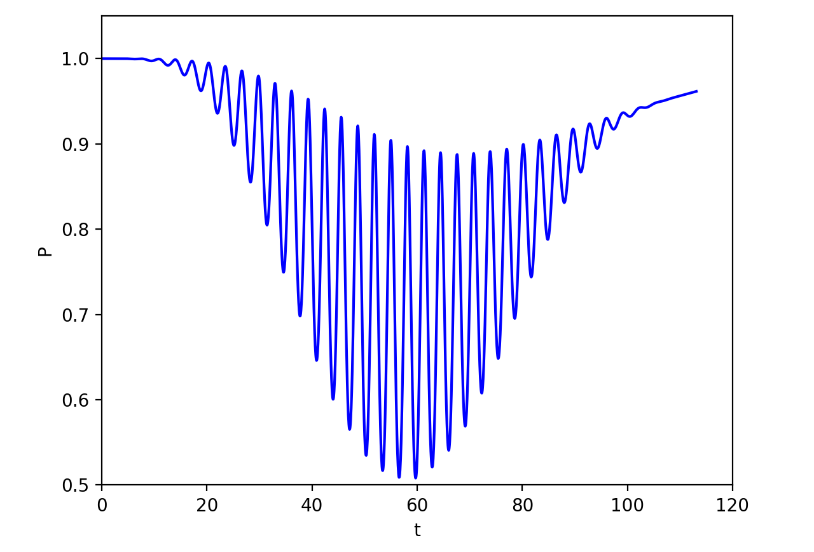

可以看出，布居数随时间的演化曲线的形状与激光的包络形状非常相像（激光包络 $\sin^2\phi$ 的相角在过程中由 $0$ 增加到 $\pi$，恰对应于图中振幅先上升后下降的情形），而在这过程中振荡了约 $2N=36$ 次，可见振荡的特征频率即是激光频率。


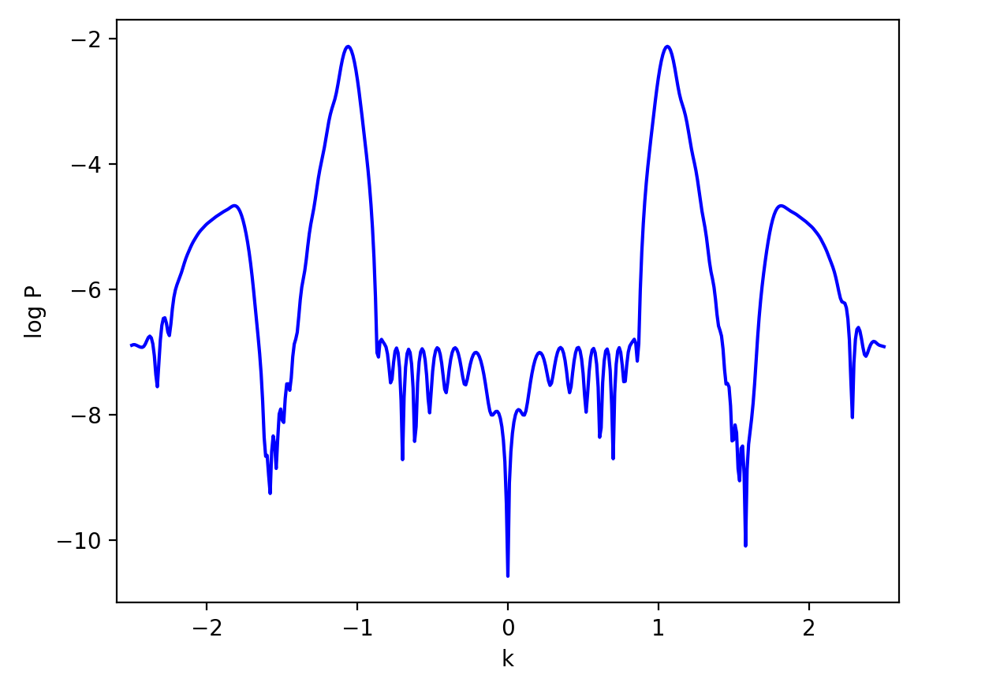

电子的动量谱在 $-1,1$ 附近有两个峰值，这是由于振荡电场在 $x$ 方向对电子加速引起的；而对数动量谱揭示了更多精细的结构，其在 $-2,2$ 附近的两个强度稍小的峰值可以看作是主峰的倍频峰。

### 源代码

```fortran
include '1.f90'
! 编译命令：gfortran 1_2.f90 -o 1_2 && ./1_2
! 参考运行时间：1 分钟

program project1_2
    use Module_1
    implicit none

    integer i, j
    real*8, parameter :: omega = 1D0, Intensity = 1D16
    real*8, parameter :: E0 = sqrt(Intensity / 3.5094448314D16)
    integer, parameter :: Periods = 18
    ! 定义时间跨度和步长、空间跨度和步长、波矢跨度和步长
    real*8, parameter :: t_max = Periods * 2 * pi / omega, dt = 5D-2
    real*8, parameter :: x_max = 2000D0, dx = 1D-1
    real*8, parameter :: k_max = 2.5D0, dk = 1D-2
    real*8, parameter :: sigma = 0.2D0, x_0 = 0.75D0*x_max
    integer, parameter :: n = nint(x_max / dx), nk = nint(k_max / dk), &
    nt = nint(t_max / dt)
    real*8 :: x(2*n+1) = (/((i-n-1)*dx, i=1, 2*n+1)/)
    real*8 :: k(2*nk+1) = (/((i-nk-1)*dk, i=1, 2*nk+1)/)
    ! 定义初态、含时态、终态、动量本征态波函数；定义概率幅
    complex*16 :: Psi_0(2*n+1) = 1, H(2*n+1,2) = 0
    complex*16 :: Psi(2*n+1) = 1, Psi_f(2*n+1) = 0, Psi_k(2*n+1) = 0
    real*8 :: P(0:nt) = 0, Pk(2*nk+1) = 0, f(2*n+1) = 1
    real*8 :: E_guess = -0.48
    real*8 :: start, end

    call cpu_time(start)
    ! 创建吸收函数
    call Absorption(f, x_0, sigma, dx)
    open(10, file = '1_2_output.txt')
    ! 初态
    call Hamiltonian(H, dx, 0D0, Periods, omega, Intensity)
    call EigenVectors(H, Psi_0, E_guess)
    call Normalize(Psi_0)

    ! 开始演化
    Psi = Psi_0
    P(0) = 1D0
    do i = 0, nt-1
        if (mod(i,100) == 0) &
        print *, '已演化', i, '步，共', nt, '步'
        ! 传播一步，并吸收，然后归一
        call Propagator(Psi, i*dt, dt, dx, Periods, omega, Intensity)
        Psi = Psi * f
        call Normalize(Psi)
        P(i+1) = abs(dot_product(conjg(Psi_0),Psi))**2
    end do

    print *, '演化完成，开始计算末态动量谱'
    ! 传播完成，计算终态并归一
    Psi_f = Psi - dot_product(conjg(Psi_0),Psi) * Psi_0
    call Normalize(Psi_f)
    ! 获得动量谱
    do i = 1, 2*nk+1
        Psi_k = exp(Im*k(i)*x)
        call Normalize(Psi_k)
        Pk(i) = abs(dot_product(Psi_f,Psi_k))**2
    end do

    write(10, *) '布居数：', P
    write(10, *) '动量谱：', Pk
    call cpu_time(end)
    print *, '运行时间：', end - start
    print *, '计算完成，结果已保存到 1_2_output.txt'
end program
```

## 高次谐波功率谱

### 问题描述

设光强 $I=2\times 10^{14}~\mathrm{W/cm^2}$，波长 $\lambda=300~\mathrm{nm}$，周期数 $N=48$，给出用偶极矩和加速度两种方法分别计算的直到 $15$ 阶的高次谐波功率谱。

### 解答思路

在上一问求出每一时刻的波函数的基础上的通过以下公式计算：

$$
d(t)=\langle\psi(x, t)|x| \psi(x, t)\rangle, \quad A(\omega)=\frac{1}{\sqrt{2 \pi}}\left(-\omega^{2}\right) \int_{0}^{t_{f}} e^{-i \omega t} d(t) \mathrm d  t
$$

$$
a(t)=\left\langle\psi(x, t)\left|-\frac{\mathrm d}{\mathrm d x} V(x)+{E}(t)\right| \psi(x, t)\right\rangle, \quad A(\omega)=\frac{1}{\sqrt{2 \pi}} \int_{0}^{t_{f}} e^{-i \omega t} a(t) \mathrm d  t
$$

### 计算结果与讨论


从功率谱上可以看出，对应于激光频率的奇次（即 $1,3,5,7,9,11$ 次）谐波的功率存在峰值，且峰值高度随次数增加而下降。两种方法图像类似，但在高频区域偶极矩法的背景信号稍强。

### 源代码

```fortran
include '1.f90'
! 编译命令：gfortran 1_3.f90 -o 1_3 && ./1_3
! 参考运行时间：5 分钟

program project1_2
    use Module_1
    implicit none

    integer i, j
    ! 这些参数意义同前
    real*8, parameter :: lambda = 300
    real*8, parameter :: omega = omega_au/lambda, Intensity = 2D14
    real*8, parameter :: E0 = sqrt(Intensity / 3.5094448314D16)
    integer, parameter :: Periods = 48
    real*8, parameter :: t_max = Periods * 2 * pi / omega, dt = 5D-2
    real*8, parameter :: x_max = 2000D0, dx = 1D-1
    ! b 代表谐波频率的倍数（1 到 15）及其步长
    real*8, parameter :: b_max = 1.5D1, db = 1D-1
    real*8, parameter :: sigma = 0.2D0, x_0 = 0.75D0*x_max
    integer, parameter :: n = nint(x_max / dx), nb = nint(b_max / db), &
    nt = nint(t_max / dt)
    complex*16 :: Psi(2*n+1) = 1, Psi_0(2*n+1) = 1, H(2*n+1,2) = 0
    real*8 :: f(2*n+1) = 1, ts(nt) = (/(i*dt, i=1, nt)/)
    ! 计算谐波需要用到的算符和 Fourier 基，A1/2 用来存储结果
    real*8 :: x(2*n+1) = (/((i-n-1)*dx, i=1, 2*n+1)/), dV(2*n+1) = 0
    complex*16 :: Fourier(nt), A1(nb) = 0, A2(nb) = 0
    real*8 :: d(nt) = 0, a(nt) = 0
    real*8 :: E_guess = -0.48, omega_harmonic, Et
    real*8 :: start, end

    call cpu_time(start)
    call Absorption(f, x_0, sigma, dx)
    open(10, file = '1_3_output.txt')
    call Hamiltonian(H, dx, 0D0, Periods, omega, Intensity)
    call EigenVectors(H, Psi_0, E_guess)
    call Normalize(Psi_0)

    ! 此部分结构与上题中一样，但增加了 d 和 a 的计算
    ! 由于 d 和 a 的算符是对角的，可以写成向量的形式
    Psi = Psi_0
    dV = x*(x**2+2)**(-1.5)
    do i = 0, nt-1
        if (mod(i, 1000) == 0) &
        print *, '已演化', i, '步，共', nt, '步'
        Et = E(i*dt, Periods, omega, Intensity)
        call Propagator(Psi, i*dt, dt, dx, Periods, omega, Intensity)
        Psi = Psi * f
        call Normalize(Psi)
        ! d 的算符是 x，a 的算符是 Et-dV，求期望即得
        d(i+1) = sum(x*abs(Psi)**2)
        a(i+1) = sum((Et-dV)*abs(Psi)**2)
    end do

    print *, '演化完成，开始计算谐波功率谱'
    ! 这里积分采用复化梯形公式计算，步长同演化步长
    do i = 1, nb
        omega_harmonic = i*db*omega
        Fourier = exp(-Im*omega_harmonic*ts)
        A1(i) = -dot_product(Fourier,d)*omega_harmonic**2/sqrt(2*pi)*dt
        A2(i) = dot_product(Fourier,a)/sqrt(2*pi)*dt
    end do

    write(10, *) '第一种方法：', abs(A1)**2
    write(10, *) '第二种方法：', abs(A2)**2

    call cpu_time(end)
    print *, '运行时间：', end - start
    print *, '计算完成，结果已保存到 1_3_output.txt'
end program
```

## 具有时间分辨率的谐波功率谱

### 问题描述

设光强 $I=1\times 10^{14}~\mathrm{W/cm^2}$，波长 $\lambda=400~\mathrm{nm}$，周期数 $N=4$，通过时频分析给出用加速度方法计算的直到 $20$ 阶的高次谐波功率谱。此问中 $x_{\max}=600$。

### 解答思路

采用加 Gauss 窗的 Fourier 变换：

$$
A\left(t_{0}, \omega\right)=\int_{0}^{t_{f}} a(t) W_{t_{0}, \omega}(t) \mathrm d  t
$$

$$
W_{t_{0}, \omega}=e^{-i \omega t} e^{-\frac{(t-t_0)^{2}}{2 \sigma^{2}}}
$$

式中 $\sigma=15$。

### 计算结果与讨论

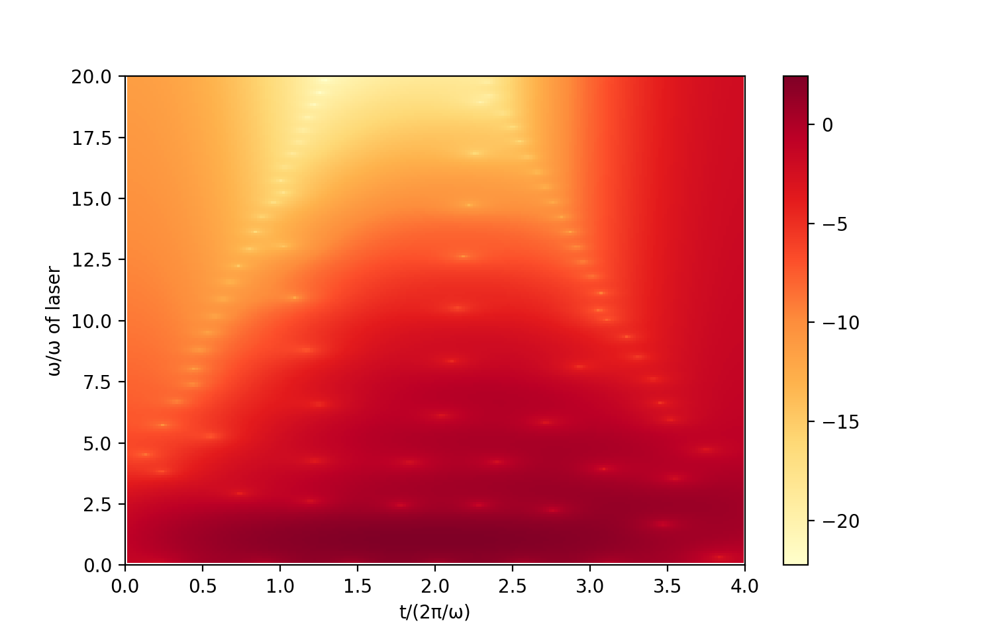

从图中可以看出，红色区域大致勾勒出了激光包络的形状，说明激光越强时所激发的高次谐波越强。

### 源代码

```fortran
include '1.f90'
! 编译命令：gfortran 1_4.f90 -o 1_4 && ./1_4
! 参考运行时间：15 秒

program project1_2
    use Module_1
    implicit none

    integer i, j
    real*8, parameter :: lambda = 400
    real*8, parameter :: omega = omega_au/lambda, Intensity = 1D14
    real*8, parameter :: E0 = sqrt(Intensity / 3.5094448314D16)
    integer, parameter :: Periods = 4
    real*8, parameter :: t_max = Periods * 2 * pi / omega, dt = 5D-2
    real*8, parameter :: x_max = 600D0, dx = 1D-1
    real*8, parameter :: b_max = 2D1, db = 1D-1
    real*8, parameter :: sigma = 0.2D0, x_0 = 0.75D0*x_max
    integer, parameter :: n = nint(x_max / dx), nb = nint(b_max / db), &
    nt = nint(t_max / dt)
    complex*16 :: Psi(2*n+1) = 1, Psi_0(2*n+1) = 1, Fourier(nt), &
    H(2*n+1,2) = 0, A2(nb) = 0
    real*8 :: x(2*n+1) = (/((i-n-1)*dx, i=1, 2*n+1)/), dV(2*n+1)
    real*8 :: ts(nt) = (/(i*dt, i=1, nt)/)
    real*8 :: f(2*n+1) = 1, d(nt) = 0, a(nt) = 0
    real*8 :: E_guess = -0.48, omega_harmonic, Et
    ! 窗函数
    real*8, parameter :: dt2 = 1, nt2 = nint(t_max / dt2), sigma_t = 15
    real*8 :: w(nt) = 0, t0
    real*8 :: start, end

    call cpu_time(start)

    call Absorption(f, x_0, sigma, dx)
    open(10, file = '1_4_output.txt')
    call Hamiltonian(H, dx, 0D0, Periods, omega, Intensity)
    call EigenVectors(H, Psi_0, E_guess)
    call Normalize(Psi_0)

    ! 这一部分与前面相同
    Psi = Psi_0
    dV = x*(x**2+2)**(-1.5)
    do i = 0, nt-1
        if (mod(i, 1000) == 0) &
        print *, '已演化', i, '步，共', nt, '步'
        Et = E(i*dt, Periods, omega, Intensity)
        call Propagator(Psi, i*dt, dt, dx, Periods, omega, Intensity)
        Psi = Psi * f
        call Normalize(Psi)
        a(i+1) = sum((Et-dV)*abs(Psi)**2)
    end do

    print *, '演化完成，开始计算谐波功率谱'
    ! 按时间逐个计算 Fourier 变换
    do i = 1, nint(t_max)-1
        t0 = i
        w = exp(-(ts-t0)**2/2/sigma_t**2)
        do j = 1, nb
            omega_harmonic = j*db*omega
            Fourier = exp(-Im*omega_harmonic*ts)
            A2(j) = dot_product(Fourier,a*w)/sqrt(2*pi)
        end do
        write(10, *) abs(A2)**2
    end do

    call cpu_time(end)
    print *, '运行时间：', end - start
    print *, '计算完成，结果已保存到 1_4_output.txt'
end program
```

\newpage

# 激光场中氢原子电离动力学的半经典模拟

## 隧穿电子样品

### 问题描述

当电场存在时，束缚电子隧穿成自由电子，距原点 $r=I_p/E$，方向为电场的背向，并获得满足如下分布的横向初速度：

$$
W \propto \frac{1}{E^{2}} \exp \left(-\frac{2}{3 E}\right) \exp \left(-\frac{v_{\perp}^{2}}{E}\right)
$$

试用 Monte Carlo 方法生成这样的电子样品。

### 解答思路

该式可以重新写成

$$
W \propto \frac{\sqrt{\pi}}{E^{\frac{3}{2}}} \exp \left(-\frac{2}{3 E}\right)\left[\frac{1}{\sqrt{\pi E}} \exp \left(-\frac{v_{\perp}^{2}}{E}\right)\right]
$$

因此可以按照 Gauss 分布抽样，而抽样的数目由 Gauss 分布前的因子决定。例如，定义抽样常数 $C$，则在电场强度为 $E$ 时，抽取如下数量的自由电子：

$$
N=C\times \frac{\sqrt{\pi}}{E^{\frac{3}{2}}} \exp \left(-\frac{2}{3 E}\right)
$$

而 Gauss 分布可以由第一类舍选法产生，舍选区间为 $[-5\sigma,5\sigma]$，其中 $\sigma=\sqrt{E/2}$。

## 正则方程求解

### 问题描述

试求解从电子时刻开始，电子在电场和 Coulumb 力共同作用下的运动方程。

### 解答思路

为计算方便，引入复电场 $\epsilon=E_x+iE_y$，复坐标 $\rho=x+iy$，复动量 $\pi=p_x+ip_y$。

首先根据矢势计算电场：

$$
\vec E_{\mathrm{Linearlly}}=-A_0\times\left[\cos^2 \frac{\omega t}{8}\times \omega\cos\omega t-\frac{\omega}{8}\sin\frac{\omega t}{4}\times \sin\omega t,0\right]
$$

$$
\begin{aligned}
\vec E_{\mathrm{Elliptically}}&=-A_0\times\left[ 
    \sqrt{\frac{4}{5}}\left(\cos^2 \frac{\omega t}{8}\times \omega\cos \omega t-\frac{\omega }{8}\sin \frac{\omega t}{4}\times \sin\omega t\right),\right.\\
    &
    \left.\sqrt{\frac{1}{5}}\left(-\cos^2 \frac{\omega t}{8}\times \omega\sin \omega t-\frac{\omega }{8}\sin \frac{\omega t}{4}\times \cos\omega t\right),
     \right] 
\end{aligned}
$$

则电子的初始状态为：

$$
\begin{aligned}
&|\rho_0|=r=I_p/E\\
&\arg\rho_0=-\arg \epsilon_0
\end{aligned}
$$

$$
\begin{aligned}
&|\pi_0|=v_\perp\\
&\arg\pi_0=\arg\rho_0+\frac{\pi }{2}
\end{aligned}
$$

体系满足的方程为：

$$
\begin{aligned}
&\frac{\mathrm d \rho}{\mathrm d t}=\pi 
\\
&\frac{\mathrm d \pi }{\mathrm d t}=-\epsilon-\frac{\rho }{(r^2+0.04)^{3/2}}
\end{aligned}
$$

用 Runge-Kutta 方法解此方程，其中 $\mathbf y=(\rho,\pi)$：

$$
\begin{aligned} \mathbf{k}_{1} &=\mathbf{f}\left(x_{n-1}, \mathbf{y}_{n-1}\right) \\ \mathbf{k}_{2} &=\mathbf{f}\left(x_{n-1}+\frac{\Delta x_{n}}{2}, \mathbf{y}_{n-1}+\frac{\Delta x_{n}}{2} \mathbf{k}_{1}\right) \\ \mathbf{k}_{3} &=\mathbf{f}\left(x_{n-1}+\frac{\Delta x_{n}}{2}, \mathbf{y}_{n-1}+\frac{\Delta x_{n}}{2} \mathbf{k}_{2}\right) \\ \mathbf{k}_{4} &=\mathbf{f}\left(x_{n}, \mathbf{y}_{n-1}+\Delta x_{n} \mathbf{k}_{3}\right) \\ \mathbf{y}_{n} &=\mathbf{y}_{n-1}+\frac{\Delta x_{n}}{6}\left(\mathbf{k}_{1}+2 \mathbf{k}_{2}+2 \mathbf{k}_{3}+\mathbf{k}_{4}\right) \end{aligned}
$$

## 渐进动量

### 问题描述

电场结束后，计算电子在无穷远处的动量。

### 解答思路

从能量、角动量、Runge-Lenz 矢量出发：

$$
\begin{aligned}
&{\frac{p_{\infty}^{2}}{2}=\frac{p_{f}^{2}}{2}-\frac{1}{r_{f}}} \\ 
&{\vec{L}=\vec{r}_{f} \times \vec{p}_{f}} \\ 
&{\vec{a}=\vec{p}_{f} \times \vec{L}-\frac{\vec{r}_{f}}{r_{f}}}
\end{aligned}
$$

无穷远处动量是：

$$
\vec{p}_{\infty}=p_{\infty} \frac{p_{\infty}(\vec{L} \times \vec{a})-\vec{a}}{1+p_{\infty}^{2} L^{2}}
$$

这里我们将上式展开，得到（其中 $L^2=(\vec r\cdot \vec r)(\vec p\cdot \vec p)-(\vec r\cdot \vec p)^2$ ）

$$
\vec p_\infty=p_\infty \frac{p_\infty(L^2 \vec p)+(\vec r\cdot \vec p)\vec r/r-r\vec p-(\vec p\cdot \vec p)\vec r+(\vec p\cdot \vec r)\vec p+\vec r/r}{1+p_\infty^2L^2}
$$

利用我们之前建立的复数表示，记

$$
u=\Re(\rho)\Re(\pi)+\Im(\rho)\Im(\pi)
$$

则可简化为

$$
\pi_\infty=p_\infty \frac{p_\infty (r^2p^2-u^2)\pi +u\rho /r-r\pi-p^2\rho+u\pi+\rho/r}{1+p_\infty^2(r^2p^2-u^2)}
$$

## 电子数目统计

### 问题描述

试统计不同渐进动量的电子数目。

### 解答思路

统计范围 $-1.5 \leq p_{x} \leq 1.5,-1.5 \leq p_{y} \leq 1.5$，格点大小 $\Delta p_{x}=\Delta p_{y}=0.02$。

按末态动量，将电子放置在 $151\times 151$ 矩阵中，然后再分别按行求和、按列求和即得。

## 计算结果与讨论

### 线偏光

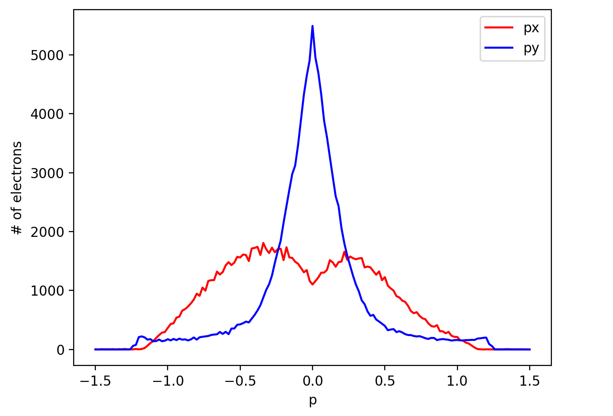


### 椭偏光


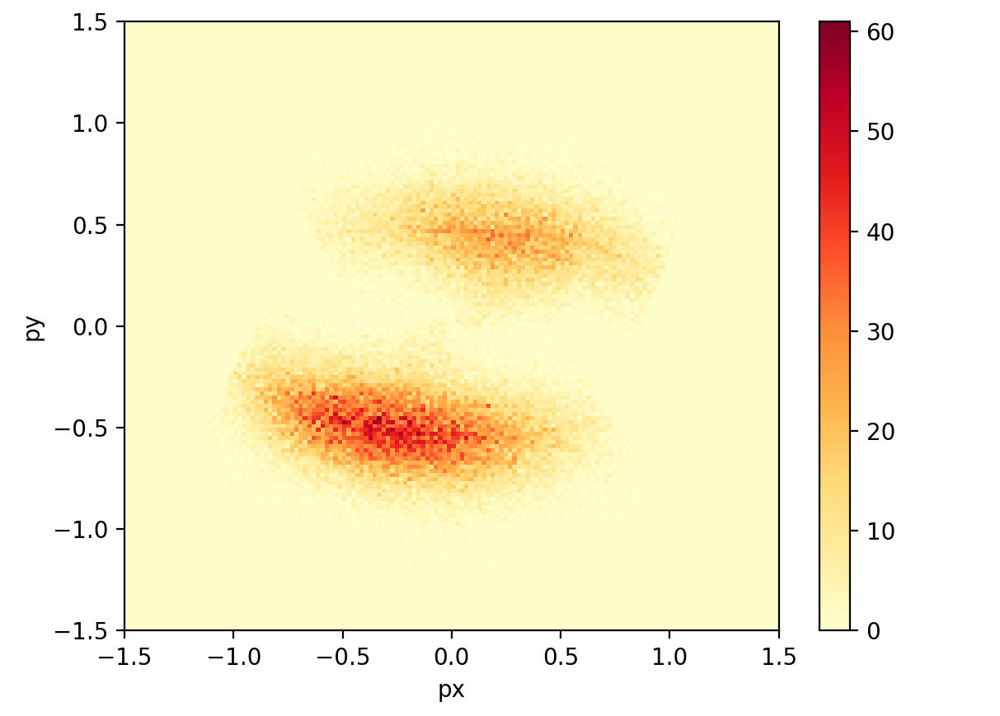

### 讨论

现在我们定性地解释图片中的结果：

对于线偏光的情形，振荡的电场使得电子在 $x$ 轴正或负方向被加速，因此结果中出现一左一右两个极大值。而电场对于 $y$ 方向并无影响，因此动量仍呈现类似于 Gauss 分布的状况。基于以上行为，二维图像中，电子弥散的方向应为光偏振的方向，因此该实验可用电离电子的动量确定偏振光的偏振方向。

对于椭偏光的情形，$x$ 方向振幅大，$y$ 方向振幅小，因此在 $x$ 方向更加离散，而在 $y$ 方向集中于两个动量峰值。二维图像中，电子弥散的方向也为光偏振的方向（集中在椭圆的两角是因为在角落处电场强度最大）。

## 源代码

```fortran
include '2.f90'
! 编译命令：gfortran 2_1.f90 -o 2_1 && ./2_1
! 参考运行时间：4 分钟

program project2_1
    use Module_2
    implicit none

    integer i, j, mode, count, nSample
    ! 动量范围
    real*8, parameter :: p_max = 1.5D0, dp = 2D-2
    ! 时间步长及步数，每一步的时间值
    real*8, parameter :: dt = 1D-1
    integer, parameter :: nt = nint(4*T0/dt), np = nint(p_max/dp)
    real*8, parameter :: t(nt) = (/((i-nt/2)*dt, i = 1, nt)/)
    ! 每一次抽样的大小由权重乘以抽样常数决定，所以是 allocatable 对象
    real*8, allocatable :: Sample(:)
    ! 限制系统大小最大为 10^6 个电子
    integer, parameter :: Sampling_Constant = 100000, maximum = 1D6
    complex*16 System(maximum,2)
    ! （复）位置、（复）动量、（复）电场，其意义见文档
    real*8 r, p, p_inf, E
    complex*16 rc, pc, pc_inf, Ec
    real*8 a, L2, u, weight
    ! 分布矩阵
    integer :: Distribution(-np:np,-np:np), Dx, Dy
    integer Distribution_x(-np:np), Distribution_y(-np:np)
    real*8 start, end

    open(10, file = '2_1_output.txt')
    call cpu_time(start)
    do mode = 1, 2
        if (mode == 1) then
            print *, '线偏光计算开始'
        else
            print *, '椭偏光计算开始'
        end if
        count = 0
        System = 0
        Distribution = 0
        do i = 1, nt
            if (mod(i, 100) == 0) &
            print *, '已演化', i, '步，共', nt, '步'
            ! 计算电场强度
            Ec = Polarized_E(t(i), mode)
            ! 微分方程演化
            do j = 1, count
                call Runge_Kutta(System(j,:), t(i), dt, mode)
            end do
            ! 新增取样
            a = atan2(aimag(-Ec),real(-Ec)) ! 复电场幅角
            E = abs(Ec)
            if (E > 0.05) then ! 电场阈值
                weight = exp(-2.0/3.0/E)/(E**1.5) ! 权重
                nSample = nint(weight*Sampling_Constant)
                r = Ip / E
                rc = r * exp(Im*a)
                ! 新增一批电子并加入系统，count 统计总电子数
                allocate(Sample(nSample))
                Sample = 0
                call Monte_Carlo(E, Sample)
                do j = 1, nSample
                    count = count + 1
                    p = Sample(j)
                    pc = p * exp(Im*(a+pi/2))
                    ! 系统记录电子的初始复位置和复动量
                    System(count,:) = (/rc, pc/)
                end do
                deallocate(Sample)
            end if
        end do

        print *, '电离与演化结束，统计渐进动量'
        ! 电离 + 演化结束，现在计算渐进动量
        do i = 1, count
            rc = System(i,1)
            r = abs(rc)
            pc = System(i,2)
            p = abs(pc)
            ! 公式推导、u 和 L2 意义见文档
            if (p**2 > 2/r) then
                p_inf = sqrt(p**2 - 2/r)
                u = real(rc)*real(pc) + aimag(rc)*aimag(pc)
                L2 = r**2*p**2 - u**2
                pc_inf = p_inf / (1+p_inf**2*L2) * &
                (p_inf*(L2*pc+u*rc/r-r*pc)-p**2*rc+u*pc+rc/r)
                ! 将动量近似到格点，填入分布矩阵
                Dx = nint(real(pc_inf)/dp)
                Dy = nint(aimag(pc_inf)/dp)
                if (abs(Dx) <= np .and. abs(Dy) <= np) &
                Distribution(Dx,Dy) = Distribution(Dx,Dy) + 1
            end if
        end do

        ! 分布矩阵按列求和，得到 x- 和 y- 分布向量
        do i = -np, np
            Distribution_x(i) = sum(Distribution(i,:))
            Distribution_y(i) = sum(Distribution(:,i))
            write(10, *) Distribution(i,:)
        end do

        write(10, *) Distribution_y
        write(10, *) Distribution_x
    end do
    call cpu_time(end)
    print *, '运行时间', end - start
    print *, '计算完成，结果已保存到 2_1_output.txt'
end program
```

\newpage

# FPU 模型

## 声子模式

### 问题描述

设 $n$ 个单位质量的质点通过相同的弹簧相互连接，首末两端固定。记 $j$ 号质点偏离平衡位
置的距离为 $q_j$，并定义 $q_0 = q_{n+1} = 0$，系统的哈密顿量写成

$$
\begin{aligned}
&{H_{\alpha}=\frac{1}{2} \sum_{j=1}^{n} p_{j}^{2}+\frac{1}{2} \sum_{j=0}^{n}\left(q_{j}-q_{j+1}\right)^{2}+\frac{\alpha}{3} \sum_{j=0}^{n}\left(q_{j}-q_{j+1}\right)^{3}} \\ 
&{H_{\beta}=\frac{1}{2} \sum_{j=1}^{n} p_{j}^{2}+\frac{1}{2} \sum_{j=0}^{n}\left(q_{j}-q_{j+1}\right)^{2}+\frac{\beta}{4} \sum_{j=0}^{n}\left(q_{j}-q_{j+1}\right)^{4}}
\end{aligned}
$$

试证对于无高次项的情形，系统具有守恒量

$$
E_{k}=\frac{1}{2} \dot{Q}_{k}^{2}+\frac{1}{2} \omega_{k}^{2} Q_{k}^{2}
$$

其中

$$
Q_{k}=\sqrt{\frac{2}{n}} \sum_{j} \sin \frac{\pi k j}{n+1} q_{j}, \quad \omega_{k}=2 \sin \frac{\pi k}{2(n+1)}
$$

### 解答思路

$$
\frac{\mathrm d E_k}{\mathrm d t}=\dot Q_k \left( \ddot Q_k +\omega_k^2 Q_k \right) 
$$

于是我们只需要证括号中项为 $0$。由于

$$
\dot{q}_{j}=\frac{\partial H}{\partial p_{j}}=p_{j} \quad \dot{p}_{j}=-\frac{\partial H}{\partial q_{j}}=q_{j-1}-2 q_{j}+q_{j+1}
$$

我们将括号中项具体展开，

$$
\sum_{j=1}^{n} \sin \left(\frac{\pi k j}{n+1}\right)\left(q_{j-1}-2 q_{j}+q_{j+1}\right)
+4\sin^2 \left(\frac{\pi k}{2(n+1)}\right)\times \left[\sum_{j=1}^{n} \sin \left(\frac{\pi k j}{n+1}\right) q_{j}\right]
$$

对任意一个 $j$，它的系数为


$$
\begin{aligned}
&-2\sin \left(\frac{\pi k j}{n+1}\right)+\sin \left(\frac{\pi k (j+1)}{n+1}\right)+\sin \left(\frac{\pi k (j-1)}{n+1}\right)\\&+\sin \left(\frac{\pi k j}{n+1}\right)\times 4\sin^2 \left(\frac{\pi k}{2(n+1)}\right)
\end{aligned}
$$

将 $\sin^2$ 项用二倍角公式展开，即是

$$
\sin \left(\frac{\pi k (j+1)}{n+1}\right)+\sin \left(\frac{\pi k (j-1)}{n+1}\right)-2\sin \left(\frac{\pi k j}{n+1}\right)\times \cos \left(\frac{\pi k}{n+1}\right)
$$

再利用和差化积公式即知该项为 $0$。由于 $j$ 的选取是任意的，故该式中任意 $q_j$ 的系数均为 $0$，因此 $E_k$ 是守恒量。

## 回归周期

### 问题描述

选取 $\alpha$-FPU 模型，令 $\alpha=0.25,n=32,Q_1(0)=4$ 而其它 $Q_k(0),\dot Q_k(0)=0$。计算 $t\in[0,160\times 2\pi/\omega_1]$ 的时间内系统的运动，并画出前四种声子模式能量随时间的变化。

### 解答思路

首先从题中所给的初始条件解出广义坐标（广义动量为 $0$)：

$$
\mathbf A \mathbf q=\mathbf Q
$$

其中

$$
a_{ij}= \sqrt{\frac{2}{n}}\sin \left( \frac{\pi i j}{n+1} \right) 
$$

矩阵 $\mathbf A$ 是可逆的，它的逆 $\mathbf B$ 表示为（相当于 Fourier 反演）

$$
b_{ij} = \frac{\sqrt{2n}}{n+1}\sin \left( \frac{\pi i j }{n+1} \right) 
$$

从上式即可计算出初始条件 $\mathbf q(0)=\mathbf B\mathbf Q(0)$。体系满足的正则方程是：

$$
\begin{aligned}
&{\dot{q}_{j}=\frac{\partial H}{\partial p_{j}}=p_{j}} \\ 
&{\dot{p}_{j}=-\frac{\partial H}{\partial q_{j}}=\left(q_{j-1}-2 q_{j}+q_{j+1}\right)+} {\alpha\left[\left(q_{j-1}-q_{j}\right)^{2}-\left(q_{j}-q_{j+1}\right)^{2}\right]}
\end{aligned}
$$

应用 Runge-Kutta 法即可解得。

### 计算结果与讨论


可以看出，在 $t\approx 155\times 2\pi/\omega_1$ 时，几乎所有能量都回到了 $E_1$ 模式上。初始能量为 $0.0724$ ，而回复的能量极大值为 $0.0710$ ，这一能量比例为：$98.1\%$。

### 源代码

```fortran
include '3.f90'
! 编译命令：gfortran 3_2.f90 -o 3_2 && ./3_2

program project3_2
    use Module_3
    implicit none

    integer i, j, k
    ! 给出参数，mode = 1 代表 alpha 模型
    integer, parameter :: n = 32, mode = 1
    real*8, parameter :: alpha = 2.5D-1
    real*8, parameter :: omega(4) = (/(2*sin(pi*i/2/(n+1)), i=1, 4)/)
    real*8, parameter :: t_max = 320*pi/omega(1), dt = 1D-1
    integer, parameter :: nt = nint(t_max/dt)
    ! 模式能量统计
    real*8 :: E1(nt/100) = 0, E2(nt/100) = 0, E3(nt/100) = 0, E4(nt/100) = 0
    real*8 :: x(2*n) = (/4D0, (0D0, i=2, 2*n)/), q(2*n) = 0
    real*8 :: start, end

    call cpu_time(start)
    open(10, file = '3_2_output.txt')
    ! 将声子的初值转化为坐标初值
    q = x
    call Phonons_Reverse(q)

    ! 进行演化
    do i = 1, nt
        call Runge_Kutta(q, dt, mode, alpha)
        ! 每演化一步，计算一次能量
        x = q
        call Phonons(x)
        if (mod(i,100) == 0) then
            E1(i/100) = x(n+1)**2/2 + x(1)**2*omega(1)**2/2
            E2(i/100) = x(n+2)**2/2 + x(2)**2*omega(2)**2/2
            E3(i/100) = x(n+3)**2/2 + x(3)**2*omega(3)**2/2
            E4(i/100) = x(n+4)**2/2 + x(4)**2*omega(4)**2/2
        end if
    end do

    write(10, *) E1
    write(10, *) E2
    write(10, *) E3
    write(10, *) E4

    call cpu_time(end)
    print *, '运行时间：', end - start
    print *, '计算完成，结果已保存到 3_2_output.txt'
end program
```

## 关于 3.2 的讨论

在进行 FPU 模型的计算时，Fermi 认为非谐项将导致体系的运动完全不具有规律，体系从而实现各态历经。而实际上数值实验结果表明能量没有在各自由度上均分的趋势，且运动具有一定的周期性。这表明，多粒子系统在相空间的轨迹可能在遍历整个相空间之前出现循环。这一性质与以下一般化的叙述有关：

Poincaré 猜测（并随后被证明），孤立系统经过足够长的时间后，将无限接近它的初始状态。利用测度论的语言，可以写成如下形式：

若 $(X,\Sigma,\mu)$ 是一个有限测度空间，$f:X\to X$ 是保测度变换，对任意集 $E\in\Sigma$，其中那些经过多次变换后总不属于 $E$ 的点测度为 $0$，即

$$
\mu\left(\left\{x \in E : \text { there exists } N \text { such that } f^{n}(x) \notin E \text { for all } n>N\right\}\right)=0
$$

这一定理的证明不在本文范围内，但值得指出的是这一定理成立的关键条件是：

1. 系统能够接触到的相空间是有限的；显然，本题中初始能量有上界这一条件保证了这一点。
2. 系统相空间体积保持不变（由 Liouville 定理保证）。

因此，经过约 $155\times 2\pi/\omega_1$ 后，体系回到了一个与初始状态接近（但不全同）的状态。由 Poincaré 回归定理的特性，我们可以期待，在更长的时间范围内能够找到一个与初始状态更为接近的状态，见下节。

## 更长的回归周期

### 问题描述

给出 $t\in[0,4000\times 2\pi/\omega_1]$ 内 $E_1$ 的变化图像。

### 解答思路

在前述基础上延长时间即可。

### 计算结果与讨论

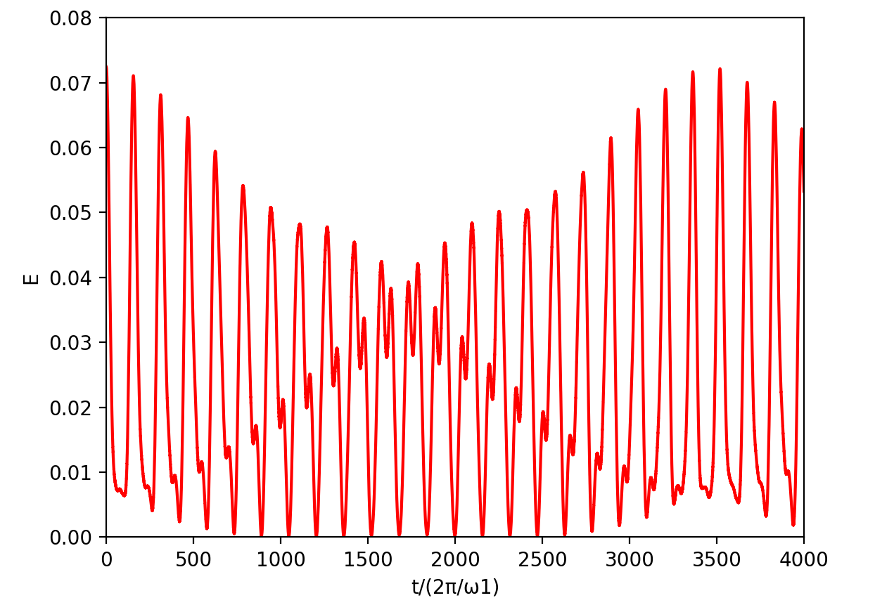

由此看出，前述的小回归周期实际上并未完全回归，而是在每一次的峰值处有所下降。在 $t\approx 3510\times 2\pi/\omega_1$ 时，峰值的这一下降趋势也重新回归到高点，达到了 $0.0722$，回归比例为 $99.7\%$。这与我们前面的讨论相符合，也即在越长的时间跨度内可以找到与初始状态越相似的状态。

### 源代码

```fortran
include '3.f90'
! 编译命令：gfortran 3_4.f90 -o 3_4 && ./3_4
! 运行时间：1 分钟

program project3_4
    use Module_3
    implicit none

    integer i, j, k
    ! 给出参数，mode = 1 代表 alpha 模型
    integer, parameter :: n = 32, mode = 1
    real*8, parameter :: alpha = 2.5D-1
    real*8, parameter :: omega(4) = (/(2*sin(pi*i/2/(n+1)), i=1, 4)/)
    real*8, parameter :: t_max = 8000*pi/omega(1), dt = 1D-1
    integer, parameter :: nt = nint(t_max/dt)
    ! 模式能量统计
    real*8 :: E1(nt/1000) = 0
    real*8 :: x(2*n) = (/4D0, (0D0, i=2, 2*n)/), q(2*n) = 0
    real*8 :: start, end

    call cpu_time(start)
    open(10, file = '3_4_output.txt')
    ! 将声子的初值转化为坐标初值
    q = x
    call Phonons_Reverse(q)

    ! 进行演化
    do i = 1, nt
        if (mod(i,100000) == 0) &
        print *, '已演化', i, '步，共', nt, '步'
        call Runge_Kutta(q, dt, mode, alpha)
        ! 每演化一步，计算一次能量
        x = q
        call Phonons(x)
        if (mod(i,1000) == 0) then
            E1(i/1000) = x(n+1)**2/2 + x(1)**2*omega(1)**2/2
        end if
    end do

    write(10, *) E1

    call cpu_time(end)
    print *, '运行时间：', end - start
    print *, '计算完成，结果已保存到 3_4_output.txt'
end program
```

## 改变初始条件

### 问题描述

取 $Q_1(0)=20$，其余参数不变，计算体系的模式能量演化。在多长时间后，系统表现出混乱的特性？讨论此时 $\langle E_k\rangle$ 与 $k$ 的关系，是否与能量均分定理相符？

### 解答思路

我们选取 $E_1$ 作为系统混乱性的表征。经过初步测算，系统在后期表现出混乱的特性。为避免系统一开始的有序运动对平均值的影响，我们取 $2000 \times 2\pi/\omega_1$ 之后的所有模式能量数据平均，来考察 $\langle E_k\rangle\sim k$ 的关系。

### 计算结果与讨论

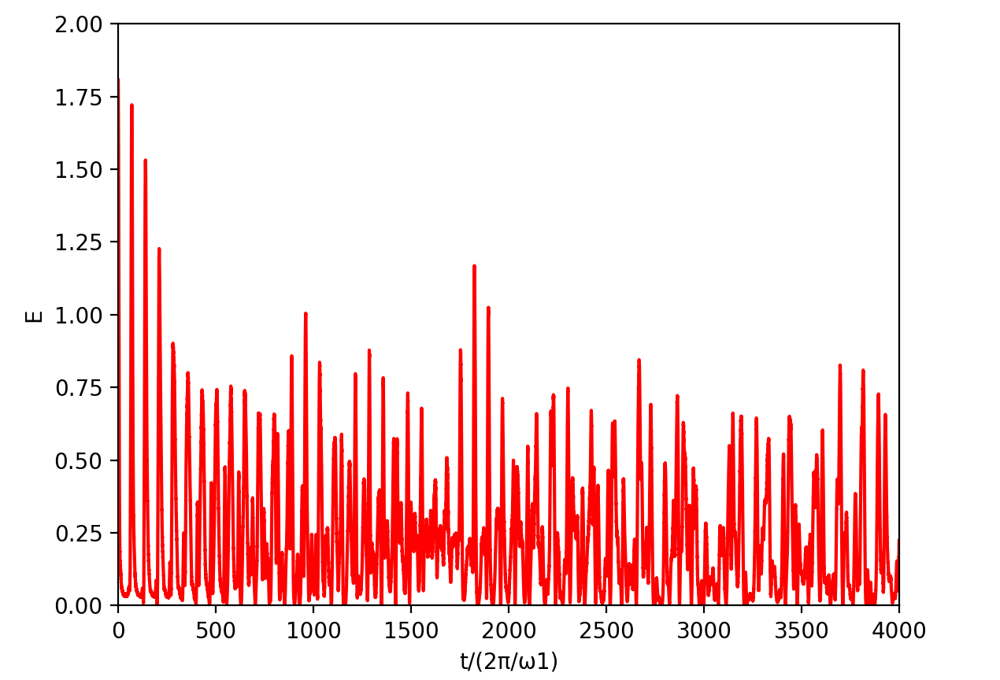

可以看出，在 $t\in[0,1000 \times 2\pi/\omega_1]$ 的范围内，体系保有着类似于上一问中的长回归周期的振荡行为；但在此之后即表现出混乱行为，虽然存在准周期性的峰值，但其高度和图样均无明显规律。


不过，即使在前述的混乱区域中，能量也并没有在各个模式上平均分配。可以看出，除了前几个模式能量较多之外，其余模式的能量均较少，显示出明显的不均衡性。能量均分原理在该体系中并不适用。

### 源代码

```fortran
include '3.f90'
! 编译命令：gfortran 3_5.f90 -o 3_5 && ./3_5
! 运行时间：1 分钟

program project3_5
    use Module_3
    implicit none

    integer i, j, k
    integer, parameter :: n = 32, mode = 1
    real*8, parameter :: alpha = 2.5D-1
    real*8, parameter :: omega(n) = (/(2*sin(pi*i/2/(n+1)), i=1, n)/)
    real*8, parameter :: t_max = 8000*pi/omega(1), dt = 1D-1
    integer, parameter :: nt = nint(t_max/dt)
    real*8 :: E1(nt/1000) = 0, average(n) = 0
    real*8 :: x(2*n) = (/2D1, (0D0, i=2, 2*n)/), q(2*n) = 0
    real*8 :: start, end

    call cpu_time(start)
    open(10, file = '3_5_output.txt')
    q = x
    call Phonons_Reverse(q)
    
    do i = 1, nt
        if (mod(i,100000) == 0) &
        print *, '已演化', i, '步，共', nt, '步'
        call Runge_Kutta(q, dt, mode, alpha)
        x = q
        call Phonons(x)
        if (mod(i,1000) == 0) then
            E1(i/1000) = x(n+1)**2/2 + x(1)**2*omega(1)**2/2
        end if
        if (i > 0.5*t_max) then
            forall(j=1:n) average(j) = average(j) + &
            x(n+j)**2/2 + x(j)**2*omega(j)**2/2
        end if
    end do

    write(10, *) E1
    write(10, *) average / (nt/2)

    call cpu_time(end)
    print *, '运行时间：', end - start
    print *, '计算完成，结果已保存到 3_5_output.txt'
end program
```

## $\beta$-FPU 模型

### 问题描述

自行选择参数，验证 $\beta$-FPU 模型中也有与之前类似的现象。

### 解答思路

选取 $\beta=5,n=32,Q_1(0)=4$ 或 $6$，演化 $2000\times 2\pi/\omega_1$。

### 计算结果与讨论

$Q_1(0)=4$ 时，图 $14$ 表明它有短周期 $T_1=102\times 2\pi/\omega_1$。仔细观察图 $15$，发现其精细波形每 $3\times T_1$ 循环一次，表明 $3T_1$ 是一更大的周期。但如果选 $Q_1(0)=6$，尽管在前 $500\times 2\pi/\omega_1$ 中较有规律，但后面却产生了混乱，这与我们在前几问中看到的行为完全一致。

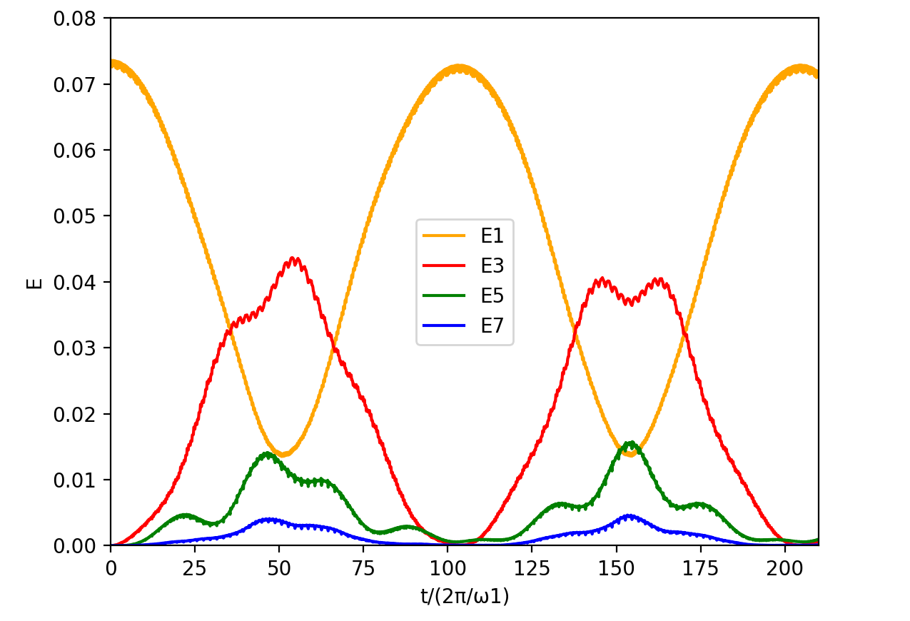

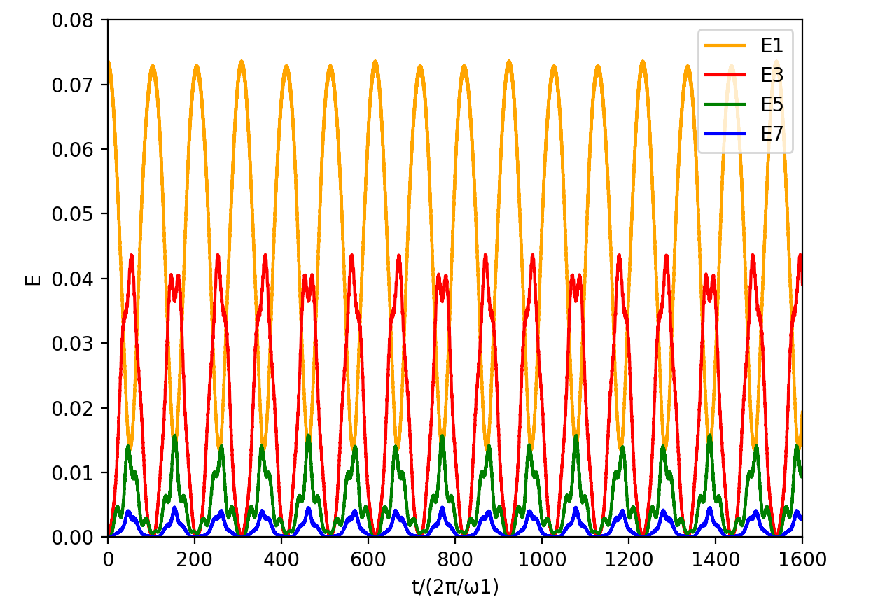

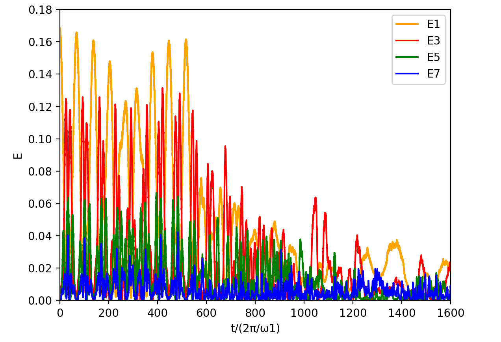

### 源代码

```fortran
include '3.f90'
! 编译命令：gfortran 3_6.f90 -o 3_6 && ./3_6
! 运行时间：1 分钟

program project3_6
    use Module_3
    implicit none

    integer i, j, k
    integer, parameter :: n = 32, mode = 2
    real*8, parameter :: beta = 5D0
    real*8, parameter :: omega(n) = (/(2*sin(pi*i/2/(n+1)), i=1, n)/)
    real*8, parameter :: t_max = 4000*pi/omega(1), dt = 1D-1
    integer, parameter :: nt = nint(t_max/dt)
    real*8 :: E1(nt/1000) = 0, E3(nt/1000) = 0, E5(nt/1000) = 0, E7(nt/1000) = 0
    real*8 :: x(2*n) = 0, q(2*n) = 0
    real*8 :: Q1(2) = (/4D0, 6D0/)
    real*8 :: start, end

    call cpu_time(start)
    open(10, file = '3_6_output.txt')

    do k = 1, 2
        print *, '初始条件 Q1 = ', Q1(k), '时的计算'
        x = 0
        x(1) = Q1(k)
        q = x
        call Phonons_Reverse(q)

        do i = 1, nt
            if (mod(i,100000) == 0) &
            print *, '已演化', i, '步，共', nt, '步'
            call Runge_Kutta(q, dt, mode, beta)
            x = q
            call Phonons(x)
            if (mod(i,1000) == 0) then
                E1(i/1000) = x(n+1)**2/2 + x(1)**2*omega(1)**2/2
                E3(i/1000) = x(n+3)**2/2 + x(3)**2*omega(3)**2/2
                E5(i/1000) = x(n+5)**2/2 + x(5)**2*omega(5)**2/2
                E7(i/1000) = x(n+7)**2/2 + x(7)**2*omega(7)**2/2
            end if
        end do

        write(10, *) '初始条件 Q1 = ', Q1(k)
        write(10, *) E1
        write(10, *) E3
        write(10, *) E5
        write(10, *) E7
    end do

    call cpu_time(end)
    print *, '运行时间', end - start
    print *, '计算完成，结果已保存到 3_6_output.txt'
end program
```

## 奇、偶次模式之间的能量扩散

### 问题描述

试证对于 $n$ 为偶数的 $\beta$-FPU 模型，若初始能量均分布在偶/奇次模式上，则随时间演化后仍然分布在偶/奇次模式上。取 $n = 16,\beta = 1$，初始条件为 $Q_{11}(0) = 1$ 而其余为 $0$，在对数标度上画出 $9$ 至 $13$ 次模式上能量的演化。解释你所观察到的现象。

### 解答思路

我们考虑从初始时刻的 $\mathbf Q(0)$ 求 Fourier 反演：

$$
\mathbf q(0)=\mathbf B \mathbf Q(0)
$$

$$
q_j(0)=\frac{\sqrt{2n}}{n+1}\sum_{k} \sin \left( \frac{\pi jk}{n+1} \right) Q_k(0)
$$

$$
q_{n+1-j}(0)=\frac{\sqrt{2n}}{n+1}\sum_{k} \sin \left( k\pi-\frac{\pi jk}{n+1} \right) Q_k(0)=\sum_{k} (-1)^{k+1}\sin \left( \frac{\pi jk}{n+1} \right) Q_k(0)
$$

若初始时刻，所有不为 $0$ 的 $Q_k(0)$ 中 $k$ 均为偶数（或奇数），则上式的 $(-1)^{k+1}$ 可以提到求和号外，于是

$$
q_j(0)=P q_{n+1-j}(0)
$$

其中 $P=\pm1=(-1)^{k+1}$ （$k$ 是任意一个满足 $Q_k(0)\ne0$ 的指标）是体系的宇称。同理，有

$$
p_j(0)=P p_{n+1-j}(0)
$$

现在考察 Hamilton 量的宇称。在 Hamilton 量中令 $j\to n+1-j$，则有

$$
H_{\beta}'=\frac{1}{2} \sum_{j=1}^{n} p_{n+1-j}^{2}+\frac{1}{2} \sum_{j=0}^{n}\left(q_{n+1-j}-q_{n-j}\right)^{2}+\frac{\beta}{4} \sum_{j=0}^{n}\left(q_{n+1-j}-q_{n-j}\right)^{4}
$$

引入指标 $i=n+1-j$，则上式化为

$$
H_{\beta}'=\frac{1}{2} \sum_{i=n}^{1} p_{i}^{2}+\frac{1}{2} \sum_{i=n+1}^{1}\left(q_{i}-q_{i-1}\right)^{2}+\frac{\beta}{4} \sum_{i=n+1}^{1}\left(q_{i}-q_{i-1}\right)^{4}
$$

再引入指标 $l=i-1$，将上式的后两项化为

$$
H_{\beta}'=\frac{1}{2} \sum_{i=n}^{1} p_{i}^{2}+\frac{1}{2} \sum_{l=n}^{0}\left(q_{l+1}-q_{l}\right)^{2}+\frac{\beta}{4} \sum_{l=n}^{0}\left(q_{l+1}-q_{l}\right)^{4}
$$

容易看出这与 $H_{\beta}$ 仅差一个求和次序，它们相等。因此 Hamilton 量在宇称操作下是不变的。根据分析力学的基本知识，这意味着体系的宇称是守恒量。因此 $\forall t$，都有

$$
\begin{aligned}
&q_j(t)=P q_{n+1-j}(t)\\
&p_j(t)=P p_{n+1-j}(t)
\end{aligned}
$$

根据此式求任意时刻的 Fourier 变换：

$$
\mathbf Q(t)=\mathbf A \mathbf q(t)
$$

其中

$$
Q_k(t) =\sqrt{\frac{2}{n}} \sum_{j} \sin \left( \frac{\pi j k}{n+1} \right) q_j(t)
$$

我们将上式中的求和按递增顺序求一遍，按递减顺序求一遍，叠加在一起，则有

$$
2Q_k(t) =\sqrt{\frac{2}{n}} \sum_{j} \sin \left( \frac{\pi j k}{n+1} \right) q_j(t) + \sin \left( \pi k-\frac{\pi j k}{n+1} \right) q_{n+1-j}(t)
$$

代入我们求出的宇称，化简给出：

$$
2Q_k(t) =\sqrt{\frac{2}{n}} \sum_{j} \sin \left( \frac{\pi j k}{n+1} \right) q_j(t) \left[ 1+(-1)^{k+1} P \right]
$$

注意我们刚才定义 $P=(-1)^{k+1}$（$k$ 是任意一个满足 $Q_k(0)\ne0$ 的指标），

- 如果上式的 $Q_k(t)$ 在初始时刻不为 $0$，则由定义，$(-1)^{k+1}=P$，$1+(-1)^{k+1} P=2$；
- 如果上式的 $Q_k(t)$ 在初始时刻为 $0$，则由定义，$(-1)^{k+1}=-P$，$1+(-1)^{k+1} P=0$；

这表明，满足 $Q_k(0)=0$ 的 $k$ 必然满足 $Q_k(t)=0$。同理，满足 $\dot Q_k(0)=0$ 的 $k$ 必然满足 $\dot Q_k(t)=0$。综上所述，初始时刻满足 $E_k(0)=0$ 的 $k$ 满足 $E_k(t)=0$。这就证明了结论。

### 计算结果与讨论


从图中可以看出，同为奇数次的 $9$ 和 $13$ 次能量快速上升，而偶数次的 $10$ 和 $12$ 次开始时几乎没有能量，但此后可能因为计算误差的累积，得到了一部分能量。考虑到双精度浮点数的误差在 $10^{-17}$ 量级，以及该非线性系统的混沌性，这一误差累积并以指数速度上升是可以理解的。

### 源代码

```fortran
include '3.f90'
! 编译命令：gfortran 3_7.f90 -o 3_7 && ./3_7

program project3_7
    use Module_3
    implicit none

    integer i, j, k
    integer, parameter :: n = 16, mode = 2
    real*8, parameter :: beta = 1D0
    real*8, parameter :: omega(n) = (/(2*sin(pi*i/2/(n+1)), i=1, n)/)
    real*8, parameter :: t_max = 320*pi/omega(1), dt = 1D-1
    integer, parameter :: nt = nint(t_max/dt)
    real*8 :: E9(nt/100) = 0, E10(nt/100) = 0, &
    E11(nt/100) = 0, E12(nt/100) = 0, E13(nt/100) = 0
    real*8 :: x(2*n) = 0, q(2*n) = 0
    real*8 :: start, end

    open(10, file = '3_7_output.txt')
    call cpu_time(start)
    x(11) = 1
    q = x
    call Phonons_Reverse(q)
    
    do i = 1, nt
        call Runge_Kutta(q, dt, mode, beta)
        x = q
        call Phonons(x)
        if (mod(i,100) == 0) then
            E9(i/100) = x(n+9)**2/2 + x(9)**2*omega(9)**2/2
            E10(i/100) = x(n+10)**2/2 + x(10)**2*omega(10)**2/2
            E11(i/100) = x(n+11)**2/2 + x(11)**2*omega(11)**2/2
            E12(i/100) = x(n+12)**2/2 + x(12)**2*omega(12)**2/2
            E13(i/100) = x(n+13)**2/2 + x(13)**2*omega(13)**2/2
        end if
    end do

    write(10, *) E9
    write(10, *) E10
    write(10, *) E11
    write(10, *) E12
    write(10, *) E13

    call cpu_time(end)
    print *, '运行时间', end - start
    print *, '计算完成，结果已保存到 3_7_output.txt'
end program
```

## 孤子解与波包扩散

### 问题描述

考虑如下形式的初始条件：

$$
\begin{array}{l}{q_{i}=B \cos \frac{\pi k(i-n / 2)}{n+1} / \cosh \left[\sqrt{\frac{3}{2}} B \omega_{k}(i-n / 2)\right]} \\ {p_{i}=\frac{B}{\cosh \left[\sqrt{\frac{3}{2}} B \omega_{k}(i-n / 2)\right]}\left\{\omega_{k}\left(1+\frac{3}{16} \omega_{k}^{2} B^{2}\right) \sin \frac{\pi k(i-n / 2)}{n+1}\right.} \\ {+\sqrt{\frac{3}{2}} B \cos \frac{\pi k(i-n / 2)}{n+1} \sin \frac{\pi k}{n+1} \tanh \left[\sqrt{\frac{3}{2}} B \omega_{k}(i-n / 2)\right] \}}\end{array}
$$

其中 $n=128,B=0.5,k=11$，分别取 $\beta=0,1$，计算系统的运动。

### 解答思路

经初步测算，系统的波包从中心处出发，在 $10\times 2\pi/\omega_{11}$ 即可发生一次循环往复的运动。

### 计算结果与讨论

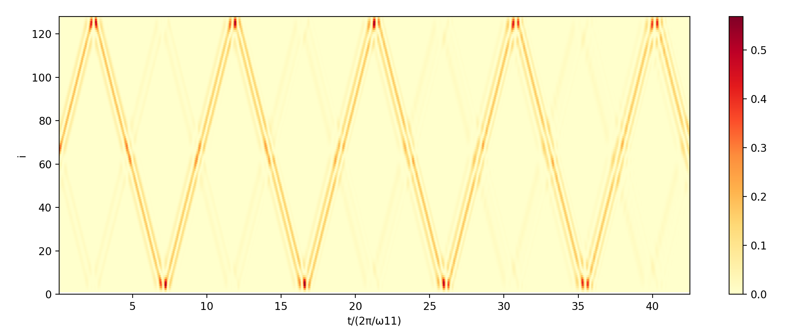

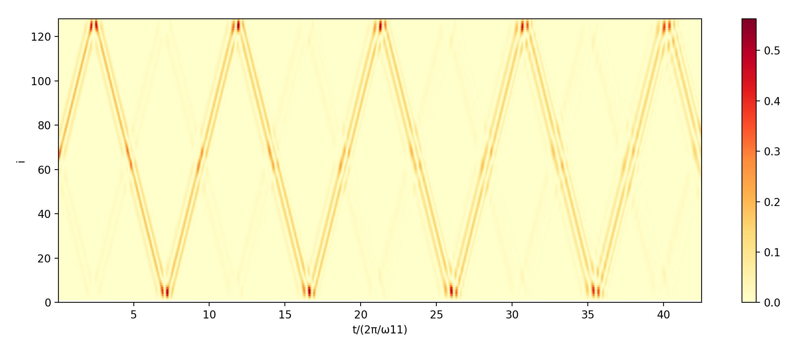

上图中，横坐标为时间，纵坐标为质点编号。可以看出，当 $\beta=1$ 时，经过 $40$ 个周期波包的形状无明显变化。而当 $\beta=0$ 时，在最后一次循环中可以明显地发现图像变模糊，而表征振动强度的线条由 $3$ 条增加至 $5$ 条，说明波包的宽度发生了明显的拓展。

### 源代码

```fortran
include '3.f90'
! 编译命令：gfortran 3_8.f90 -o 3_8 && ./3_8

program project3_8
    use Module_3
    implicit none

    integer i, j, mode
    integer, parameter :: n = 128, k = 11
    real*8, parameter :: beta = 1D0
    real*8, parameter :: omega(n) = (/(2*sin(pi*i/2/(n+1)), i=1, n)/), B = 0.5
    real*8, parameter :: t_max = 100*pi/omega(11), dt = 0.01*pi/omega(11)
    integer, parameter :: nt = nint(t_max/dt)
    real*8 :: x(2*n) = (/(0D0, i=1, 2*n)/), q(2*n) = 0
    real*8 :: start, end, z1, z2

    open(10, file = '3_8_output.txt')
    call cpu_time(start)
    do mode = 0, 2, 2
        ! 给初始条件
        do i = 1, n
            z1 = pi*k*real(i-n/2)/(n+1)
            z2 = sqrt(1.5)*B*omega(k)*(i-n/2)
            q(i) = B*cos(z1)/cosh(z2)
            q(i+n) = B/cosh(z2)*(omega(k)*(1+0.1875*omega(k)**2*B**2) &
            *sin(z1)+sqrt(1.5)*B*cos(z1)*sin(pi*omega(k))*tanh(z2))
        end do
        ! 计算每一时刻的振幅
        do i = 1, nt
            if (mod(i,10) == 0) &
            write(10, *) real(q(1:n) ** 2,4)
            call Runge_Kutta(q, dt, mode, beta)
        end do
    end do

    call cpu_time(end)
    print *, '运行时间', end - start
    print *, '计算完成，结果已保存到 3_8_output.txt'
end program
```

\newpage

\appendix

# 致谢

感谢北京大学物理学院彭良友老师对于计算物理学知识详尽准确的介绍。

感谢北京大学物理学院赵忠海学长、刘士琦学姐针对作业进行的必要的提示以及回答我在编写程序时的疑问。
\newpage

# 第一题模块源代码

```fortran
module Module_1

real*8, parameter :: pi = 3.1415926535897932384D0
complex*8, parameter :: Im = complex(0D0,1D0)
real*8, parameter :: E_au = 3.5094448314D16
real*8, parameter :: omega_au = 45.5633525316

contains

! 电场强度，作为周期数、频率、强度的函数
function E(t, Periods, omega, Intensity)
	implicit none
	integer Periods
	real*8 t, omega, Intensity, E

	E = sqrt(Intensity/E_au) * sin(omega*t) &
	 * (sin(omega*t/2/Periods))**2
	return
end function

! 波函数按 2-范数归一化
subroutine Normalize(v)
	real*8 norm
	complex*16 v(:)

	norm = sqrt(sum(abs(v)**2))
	v = v / norm
end subroutine Normalize

! 根据所给参数生成吸收函数
subroutine Absorption(f, x_0, sigma, dx)
	implicit none
	integer i, m, n
	real*8 f(:), x_0, sigma, dx, x

	n = size(f)
	m = (n + 1)/2
	do i = 1, n
		x = real(i-m,8)*dx
		if (abs(x) > x_0) &
		f(i) = exp(-(abs(x)-x_0)**2/sigma**2)
	end do
end subroutine

! 通过离散化构建 Hamiltonian
subroutine Hamiltonian(H, dx, t, Periods, omega, Intensity)
	implicit none
	integer n, i, m, Periods
	real*8 dx, t, omega, Intensity
	complex*16 H(:,:)

	n = size(H,1)
	m = (n + 1)/2
	! 动能部分
	forall(i=1:n) H(i,1) = -2
	forall(i=2:n) H(i,2) = 1
	H = H / (-2 * dx**2)
	! 势能部分（Columb 势和电势）
	forall(i=1:n) H(i,1) = H(i,1) - &
	1/sqrt((real(i-m,8)*dx)**2+2)
	do i = 1, n
		H(i,1) = H(i,1) + real(i-m,8)*dx*E(t, Periods, omega, Intensity)
	end do
end subroutine

! 反幂法求本征值
! 注意，对称三对角阵是以 n*2 矩阵的形式存储的
subroutine EigenVectors(H, v, p)
	implicit none
	integer i, j, k, n
	complex*16 :: H(:,:), v(:)
	complex*16, allocatable :: u(:)
	complex*16, allocatable :: A(:,:)
	real*8 p, lambda

	n = size(H,1)
	allocate(u(n),A(n,2))
	A = H

	! 原点位移
	forall(i=1:n) A(i,1) = A(i,1) - p
	u = 0
	! LDL^T 分解
	call LDL_Decomposition_Tridiagonal(A)
	do while (sum(abs(u-v)**2) > 1D-10)
		! 解方程
		u = v
		do i = 1, n
			v(i) = v(i) - a(i,2) * v(i-1)
		end do
		do i = n, 1, -1
			v(i) = v(i) / a(i,1) - a(i+1,2) * v(i+1)
		end do
		! 近似特征值
		lambda = 1 / maxval(abs(v))
		! 规定在0到90度范围函数平均值大于0
		if (real(sum(v(1:n/4))) < 0) lambda = -lambda
		v = v * lambda
	end do
	p = p + lambda
end subroutine

! 对称三对角阵的 LDL^T 分解
subroutine LDL_Decomposition_Tridiagonal(a)
	implicit none
	integer i, j, k, n
	complex*16 a(:,:)

	n = size(a,1)
	do i = 2, n
		! 非对角元
		a(i,2) = a(i,2) / a(i-1,1)
		! 对角元
		a(i,1) = a(i,1) - a(i,2)**2 * a(i-1,1)
	end do
end subroutine

! 传播子
subroutine Propagator(Psi, t, dt, dx, Periods, omega, Intensity)
	implicit none
	integer i, n, Periods
	complex*16 Psi(:)
	real*8 t, dt, dx, omega, Intensity
	complex*16, allocatable :: H(:,:), A(:,:), Psi_(:)

	n = size(Psi)
	allocate(H(n,2), A(n,2), Psi_(n))

	! 计算这一时刻的 Hamiltonian，并作矩阵乘法
	call Hamiltonian(H, dx, t, Periods, omega, Intensity)
	A = -Im*dt/2*H
	forall(i=1:n) A(i,1) = A(i,1) + 1

	Psi_ = A(:,1) * Psi
	Psi_(2:n) = Psi_(2:n) + A(2:n,2) * Psi(1:n-1)
	Psi_(1:n-1) = Psi_(1:n-1) + A(2:n,2) * Psi(2:n)
	Psi = Psi_

	! 计算下一时刻的 Hamiltonian，并解线性方程
	call Hamiltonian(H, dx, t+dt, Periods, omega, Intensity)
	A = Im*dt/2*H
	forall(i=1:n) A(i,1) = A(i,1) + 1
	call LDL_Decomposition_Tridiagonal(A)
	do i = 1, n
		Psi(i) = Psi(i) - A(i,2) * Psi(i-1)
	end do
	do i = n, 1, -1
		Psi(i) = Psi(i) / A(i,1) - A(i+1,2) * Psi(i+1)
	end do
end subroutine Propagator

end module
```

\newpage

# 第二题模块源代码

```fortran
module Module_2

real*8, parameter :: pi = 3.1415926535897932384D0
complex*16, parameter :: Im = complex(0D0,1D0)
real*8, parameter :: omega = 5.7D-2
real*8, parameter :: T0 = 2*pi/omega
real*8, parameter :: A0 = 1.325D0
real*8, parameter :: Ip = 5D-1

contains

! Monte Carlo 抽样子程序
subroutine Monte_Carlo(E, Sample)
	implicit none
	integer :: count, n
	real*8 E, sigma
	real*8 Sample(:)
	real*8 u1, u2, v
	
	sigma = sqrt(E/2)

	call random_seed()
	count = 1
	n = size(Sample)
	do while(count < n)
		! 舍选抽样法
		! 抽到符合条件电子放入 Sample
		! 直到 Sample 抽满
		call random_number(u1)
		v = 10*sigma*u1 - 5*sigma
		call random_number(u2)
		if (u2 < exp(-v**2/E)) then
			Sample(count) = v
			count = count + 1
		end if
	end do
end subroutine Monte_Carlo

! 复电场计算函数
! mode = 1 是线偏光，= 2 是椭偏光
function Polarized_E(t, mode) result(E)
	implicit none
	integer mode
	real*8 t
	complex*16 E

	! 公式推导见文档
	if (mode == 1) then
		E = - A0 *(cos(omega*t/8)**2 * omega* cos(omega*t) - &
			sin(omega*t/4)*omega/8 * sin(omega*t))
	else
		E = - A0 * complex(&
			(cos(omega*t/8)**2 * omega* cos(omega*t) - &
			sin(omega*t/4)*omega/8 * sin(omega*t)) *sqrt(0.8), &
			(-cos(omega*t/8)**2 * omega* sin(omega*t) - &
			sin(omega*t/4)*omega/8 * cos(omega*t)) *sqrt(0.2))
	end if
	return
end function

! 体系的正则方程
subroutine Canonical(q, t, mode)
	implicit none
	integer mode
	real*8 t
	complex*16 q(:), E

	E = Polarized_E(t, mode)
	! 复位置的导数是复动量
	! 复动量的导数是 Coulumb 力和电场力之和
	q(:) = (/q(2),-q(1)/((abs(q(1))**2+0.04D0)**1.5) - E/)
end subroutine Canonical

! Runge_Kutta 法进行方程的一步演化
subroutine Runge_Kutta(q, t, dt, mode)
	implicit none
	integer mode, n
	complex*16 q(:)
	real*8 t, dt
	complex*16 k1(2), k2(2), k3(2), k4(2)

	k1 = q
	call Canonical(k1, t, mode)
	k2 = q + dt * k1 / 2
	call Canonical(k2, t + dt / 2, mode)
	k3 = q + dt * k2 / 2
	call Canonical(k3, t + dt / 2, mode)
	k4 = q + dt * k3
	call Canonical(k4, t + dt, mode)
	q = q + dt * (k1+2*k2+2*k3+k4)/6
end subroutine Runge_Kutta
end module
```

\newpage

# 第三题模块源代码

```fortran
module Module_3

real*8, parameter :: pi = 3.1415926535897932384D0

contains

! 将坐标转换为声子模式，q → Q
subroutine Phonons(q)
	implicit none
	integer n, i, j
	real*8 q(:)
	! A 是 Fourier 矩阵
	real*8, allocatable :: A(:,:), q2(:,:)

	n = size(q)/2
	allocate(A(n,n),q2(2*n,1))

	! 构建 Fourier 矩阵
	forall(i=1:n,j=1:n)
		A(i,j) = sqrt(2.0/real(n))*sin(pi*i*j/(n+1))
	end forall

	! 进行变换
	q2 = spread(q,2,1)
	q2(1:n,1) = matmul(A,q2(1:n,1))
	q2(n+1:2*n,1) = matmul(A,q2(n+1:2*n,1))
	q = q2(:,1)
end subroutine Phonons

! 将声子模式转换为坐标，Q → q
subroutine Phonons_Reverse(x)
	implicit none
	integer n, i, j, k
	real*8 x(:)
	real*8, allocatable :: A(:,:), x2(:,:)

	n = size(x)/2
	allocate(A(n,n),x2(n,1))

	! 构建 Fourier 矩阵
	forall(i=1:n,j=1:n)
		A(i,j) = sqrt(2*real(n))/(n+1)*sin(pi*i*j/(n+1))
	end forall

	! 进行变换
	x2 = spread(x(1:n),2,1)
	x2 = matmul(A,x2)
	x(1:n) = x2(:,1)
end subroutine Phonons_Reverse

! 体系的正则方程
subroutine Canonical(q, mode, para)
	implicit none
	integer mode, n, i, j
	real*8 q(:), para
	real*8, allocatable :: r(:)

	n = size(q)/2
	allocate(r(n))
	r = q(n+1:2*n)

	! 这是谐振子部分的受力
	q(n+1) = -2*q(1) + q(2)
	do i = 2, n-1
		q(n+i) = q(i-1) - 2*q(i) + q(i+1)
	end do
	q(2*n) = q(n-1) - 2*q(n)

	! 非谐部分的受力，分两种模式，alpha 和 beta
	if (mode == 1) then
		q(n+1) = q(n+1) + para * ((-q(1))**2-(q(1)-q(2))**2)
		do i = 2, n-1
			q(n+i) = q(n+i) + para * ((q(i-1)-q(i))**2-(q(i)-q(i+1))**2)
		end do
		q(2*n) = q(2*n) + para * ((q(n-1)-q(n))**2-(q(n))**2)
	else if (mode == 2) then
		q(n+1) = q(n+1) + para * ((-q(1))**3-(q(1)-q(2))**3)
		do i = 2, n-1
			q(n+i) = q(n+i) + para * ((q(i-1)-q(i))**3-(q(i)-q(i+1))**3)
		end do
		q(2*n) = q(2*n) + para * ((q(n-1)-q(n))**3-(q(n))**3)
	end if
	q(1:n) = r
end subroutine Canonical

! Runge Kutta 演化
subroutine Runge_Kutta(q, dt, mode, para)
	implicit none
	integer mode, n
	real*8 q(:), dt, para
	real*8, allocatable :: k1(:), k2(:), k3(:), k4(:)

	n = size(q)
	allocate(k1(n),k2(n),k3(n),k4(n))
	k1 = q
	call Canonical(k1, mode, para)
	k2 = q + dt * k1 / 2
	call Canonical(k2, mode, para)
	k3 = q + dt * k2 / 2
	call Canonical(k3, mode, para)
	k4 = q + dt * k3
	call Canonical(k4, mode, para)
	q = q + dt * (k1+2*k2+2*k3+k4)/6
end subroutine Runge_Kutta

end module
```