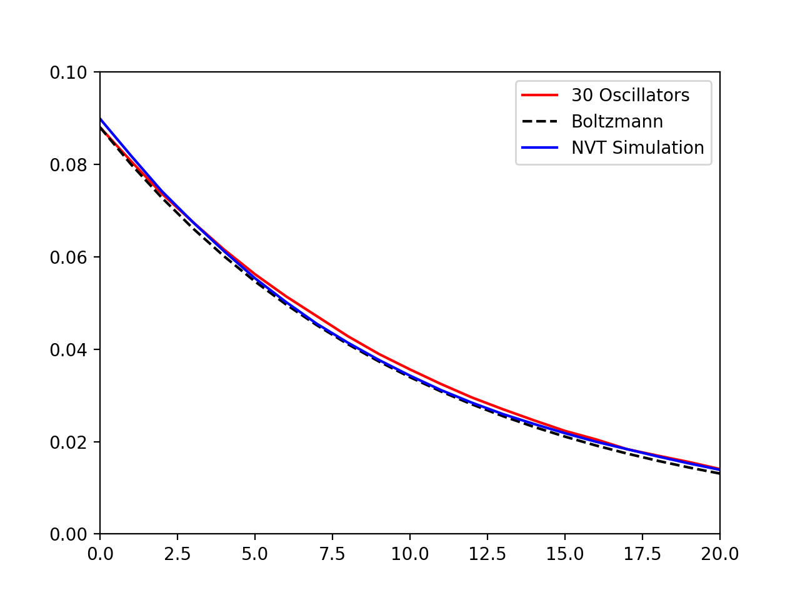
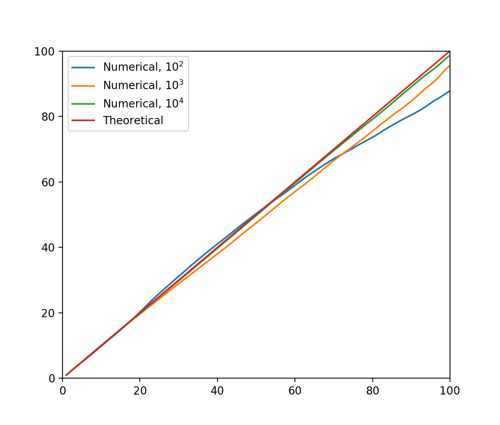
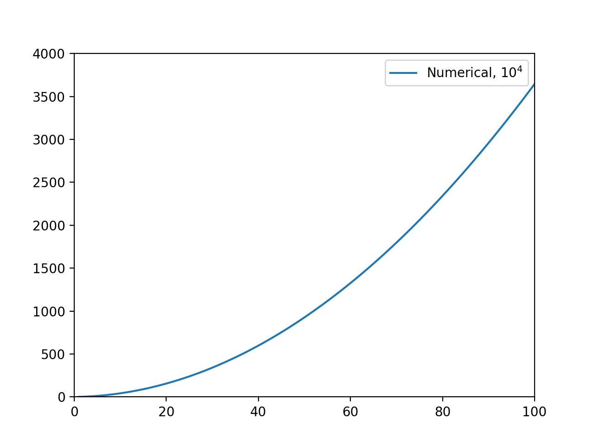
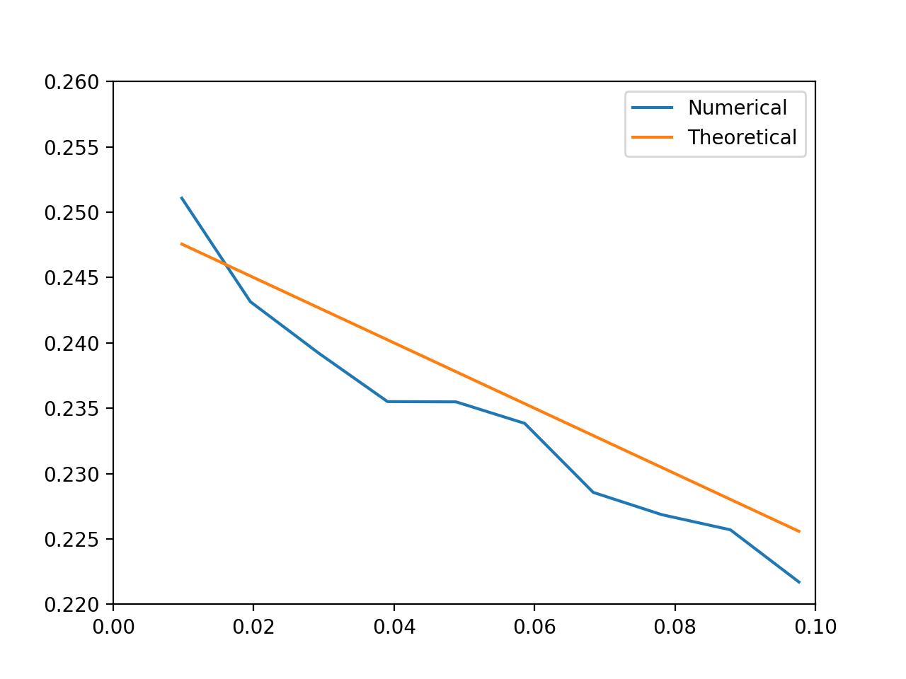
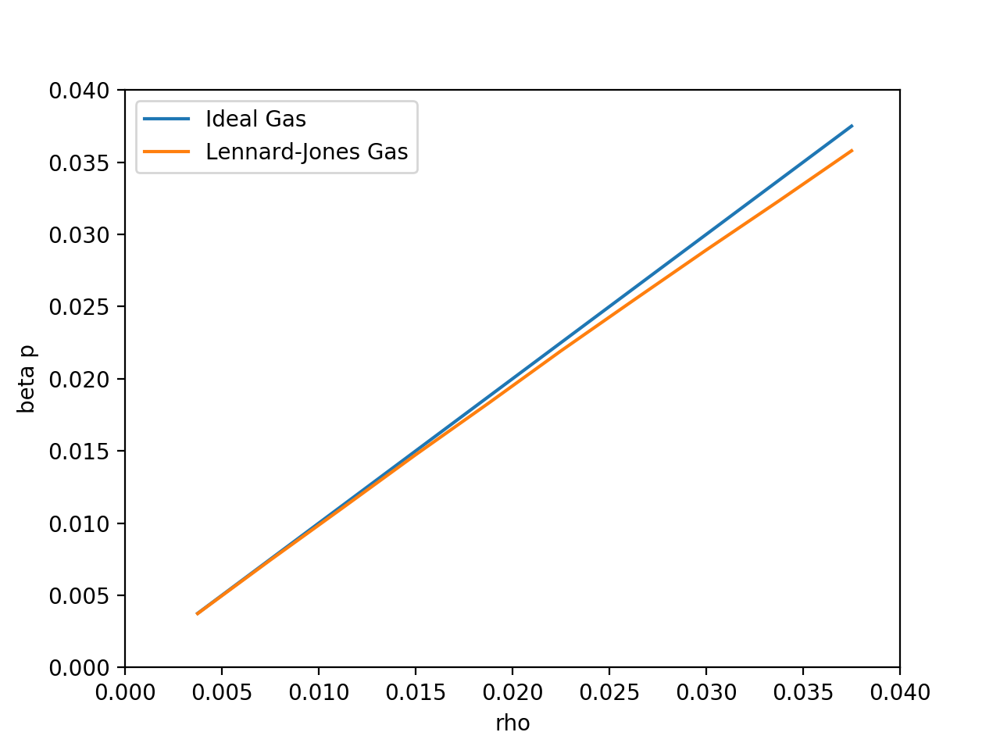

这里存放了 *Understanding Molecular Simulation: From Algorithms to Applications* 这本书的全部 16 个程序设计练习。由于源文件是使用 Fixed Format 的 Fortran 77 格式，在这里先将其转为 Fortran 90 格式再进行相应模块编写。阅读说明：

1. 设题号为 `<n>`，题目中如果有未完成的代码，则用 `<n>_0.f90` 命名，已完成的代码用 `<n>.f90` 命名，输出文件用 `<n>.dat` 命名。
2. 如果题目中有不止一个需要运行的程序，则用 `<n>_<i>.f90` 命名，`<i>` 是序号数，相应的输出文件用 `<n>_<i>.dat` 命名。
3. 如果题目中有作图题，这里使用 Python 的 `matplotlib` 库进行作图，处理 `<n>_<i>.dat` 作图的程序命名为 `<n>_<i>.py`，生成的图片命名为 `<n>_<i>.png`。

完成情况：

| 题号 | 情况   |
| ---- | ------ |
| 1    | 完成   |
| 2    | 完成   |
| 3    | 完成   |
| 4    | 完成   |
| 5    | 存疑   |
| 6    | 完成   |
| 7    | 完成   |
| 8    | 未完成 |
| 9    | 存疑   |
| 10   | 未完成 |
| 11   | 未完成 |
| 12   | 未完成 |
| 13   | 未完成 |
| 14   | 未完成 |
| 15   | 未完成 |
| 16   | 未完成 |

# Exercise 1（Distribution of Particles, Chpt 02）

## 2

$n$ 球放入 $p$ 盒子，有一个盒子为空的概率大约是

$$
p\times \frac{(p-1)^n}{p^n}
$$

不过精确的值也不太会算……

## 3

见 `1.dat`。要证明这个分布对小的 $n_1/N$ 是 Gaussian 的，就是要证明

$$
P(n_1)\approx P(0)e^{-An_1^2}
$$

其中 $A$ 是待定系数。为此我们计算两者的比值：

$$
\frac{P(n_1)}{P(0)}=\frac{(N/2)!(N/2)!}{(N/2-n_1)!(N/2+n_1)!}
$$

现在将阶乘用 Stirling 公式展开，注意到 $\sqrt{2\pi}$ 和 $e^{-x}$ 项都抵消了，所以

$$
=\frac{(N/2)^{N+1}}{(N/2-n_1)^{N/2-n_1+1/2}(N/2+n_1)^{N/2+n_1+1/2}}
$$

再取对数，

$$
\ln(\cdot)=(N+1)\ln\frac N2-\left(\frac N2-n_1+\frac12\right)\ln\left(\frac N2-n_1\right)-\left(\frac N2+n_1+\frac12\right)\ln\left(\frac N2+n_1\right)
$$

对上式中的 $\ln$ 函数在 $N/2$ 处展开并保留到一阶，得到
$$
=\left(\frac N2-n_1+\frac 12\right)\times-\frac{2n_1}N+\left(\frac N2+n_1+\frac 12\right)\times\frac{2n_1}N=\frac{4n_1^2}N
$$
这样我们就证明了它是 Gaussian 的。

# Exercise 2（Boltzmann Distribution, Chpt 2）

## 1

当温度很高时，这些能级上近似于均匀分布。

## 2

在温度相同时，相比于（1）中分布向高能级偏移。

## 3

输入温度使近似公式中 $q=10$，计算出 $q=10.34$。

# Exercise 3（Coupled Harmonic Oscillators, Chpt 2）

## 1

经过比较，我觉得本书作者写的算法是辣鸡。

## 2

画张好图居然要 1 亿个循环……我们保持平均能量是 10，每次增加 3 个谐振子：

可见随谐振子数量升高，趋于 Boltzmann 分布（这里采取平均能量为 10 时的等效温度 0.09531）。这样，其他的谐振子充当的就是热浴作用。

## 3

按 0.09531 进行恒温模拟，与上面类似。

## 4

联系是显然的。系统（一个谐振子）能量越高，环境（NVE 系综中其他谐振子）能量越低，环境简并度越低，因此处于这样的状态概率越小。这与通过微正则系综推导正则系综的过程完全一致。

# Exercise 4（Random Walk on a 1D Lattice, Chpt 2）

这个程序的写法也太反人类了！

## 1

不妨假设 N 是偶数。则 n 也是偶数，达到 n 需要经过 $(N+n)/2$ 次向右移动和 $(N-n)/2$ 次向左移动。这样的概率由组合数给出：
$$
\ln P(n,N)=\ln \frac1{2^N}\binom{N}{(N+n)/2}
$$
用 Stirling 公式化简：
$$
=-N\ln 2+\ln\frac{N^{N+1/2}}{\sqrt{2\pi}((N+n)/2)^{(N+n)/2+1/2}+((N-n)/2)^{(N-n)/2+1/2}}
$$
化简过程和上面某题类似，最后得到
$$
\frac12\ln\left(\frac2{\pi N}\right)-\frac{n^2}{2N}
$$

## 2

均方位移就是分布函数的方差 $N$，时间也是 $N$，所以扩散率 $D=1/2$。根据琴生不等式，采样比较少的时候会有负偏差。

## 3

由于产生了向一侧移动的倾向，扩散率显著提高，而且随 N 呈二次函数变化：

# Exercise 5（Random Walk on a 2D Lattice, Chpt 2）

## 1

就是 $\theta=N/M^2$

## 2

橙线是 $0.25(1-\theta)$，蓝线是实验结果。

在浓度低时，移动的接受率正比于空位的数量，所以呈线性关系。

## 3

见 `5_2.dat`，例如增加向下移动的概率而均匀减小其他三个的概率，则 $x$ 方向的迁移率减小，$y$ 方向增大。

## 4

迁移率只跟绝对位移有关系所以好像没影响？？？

# Exercise 6（Calculation of $\pi$, Chpt 3）

## 1

不失一般地，我们认为 $d=2$，则在 $l\times l$ 的正方形中投点，如果满足 $x^2+y^2<1$ 就计数。

## 3

$\pi$ 的估计值 $\pi^*$ 由下式给出：
$$
\pi^*=\frac{l^2}{N}\sum_i\mathbb I(x_i^2+y_i^2<1)
$$
其中 $\mathbb I$ 是指示函数，这个指示函数的期望是 $\pi/l^2$。因此方差为
$$
\begin{aligned}
\sigma^2&=\left(\frac{l^2}{N}\right)^2\sum_i\left\langle \left(\mathbb I(x_i^2+y_i^2<1)-\frac{\pi}{l^2}\right)^2\right\rangle\\
&=\frac{\pi(l^2-\pi)}{N}
\end{aligned}
$$
所以应该让边长比较小。

## 4

废话……

# Exercise 7（The Photon Gas, Chpt 3）

## 1

是符合的。$0\to 1$ 的概率是 $0.5\times e^{-\beta}$，而 $1\to 0$ 的概率是 $0.5$。

## 2

1. 是正确的。假设 $i<j$，那么 $i\to j$ 的概率是 $0.909\times e^{-\beta(j-i)}$，$j\to i$ 的概率是 $0.909$。
2. 不正确。只能生成那些模 3 同余的态。

## 3

见 `7_1.f90`，与理论结果符合很好。

## 4

在 `7_1.f90` 给出的结果大约有 0.01 的误差的情况下，`7_2.f90` 的误差在 0.5 左右。显然这种做法违反了细致平衡原理。

特别是 $\beta \gg 1$ 时，可以证明 `7_2.f90` 给出的能量将精确地为 0.5，而实际能量 $\to 0$，所以此时（相对）误差最大。

## 5

统计前 100 能级的频数，并按 0 能级的归一化。与解析结果符合很好（精确到小数点后 3 位）。

# Exercise 8（Monte Carlo Simulation of a Lennard-Jones System）

## 1

$$
\mathrm{vir}=\sum_{i<j}\left(\frac{48}{r_{ij}^{12}}-\frac{24}{r_{ij}^6}\right)
$$

## 2

## 3

懒得整

## 4

$$
C_V=\beta^2(\langle E^2\rangle-\langle E\rangle^2)
$$

## 5

假设 $\Delta U$ 关于位移是线性的， 那么要求
$$
e^{-\beta \langle\Delta U\rangle}=\frac12
$$
N 粒子同时移动，$\Delta U=\ln 2/N\beta$。

## 6

不能。均方位移只与温度有关，而与位移分布的具体形式有关。（Gaussian 分布的接受度会比较大，但这些接受的都是比较小的位移。）

# Exercise 9（Scaling as a Monte Carlo Move, Chpt 3）

## 1

由于 Boltzmann 因子在 $[0,1]$ 之间是常数，这要求当 $0<x_1<x_2<1$ 时：
$$
\alpha(x_1\to x_2)\mathrm{acc}(x_1\to x_2)=\alpha(x_2\to x_1)\mathrm{acc}(x_2\to x_1)
$$

### 位移

不妨设 $|x_1-x_2|<\delta$。此时 $\alpha(x_1\to x_2)=\alpha(x_2\to x_1)=1/2\delta$ （用概率密度衡量）。因此 $\mathrm{acc}$ 可以均取为 1。

### 标度

不妨设 $x_2<(1+\delta)x_1,x_1>x_2/(1+\delta)$。此时，
$$
\alpha(x_1\to x_2)=\lim_{\Delta x\to 0}\frac{1}{\Delta x}\left[\frac{x_2+\Delta x}{x_1}-\frac{x_2}{x_1}\right]=\frac1{x_1}
$$

$$
\alpha(x_2\to x_1)=\lim_{\Delta x\to 0}\frac1{\Delta x}\left[\frac{x_2}{x_1-\Delta x}-\frac{x_2}{x_1}\right]=\frac{x_2}{x_1^2}
$$

可见概率密度是不等的。所以应设 $\mathrm{acc}(x_1\to x_2)=x_2/x_1$。

## 2

见 `9.dat`，对两种移动方式都成功生成了 $[0,1]$ 上的均匀分布。

## 3

由于 $\alpha(x_2\to x_1)$ 更大些，会向 0 的邻域集中。

# Exercise 10（Molecular Dynamics of a Lennard-Jones System, Chpt 4）

# Exercise 11（Monte Carlo in $NPT$ Ensemble, Chpt 5）

# Exercise 12（Ising Model, Chpt 5）

# Exercise 13（Barrier Crossing, Chpt 6）

# Exercise 14（Vapor-Liquid Equilibrium, Chpt 8）

# Exercise 15（CBMC of a Single Chain, Chpt 13）

# Exercise 16（CBMC of a Simple System, Chpt 13）